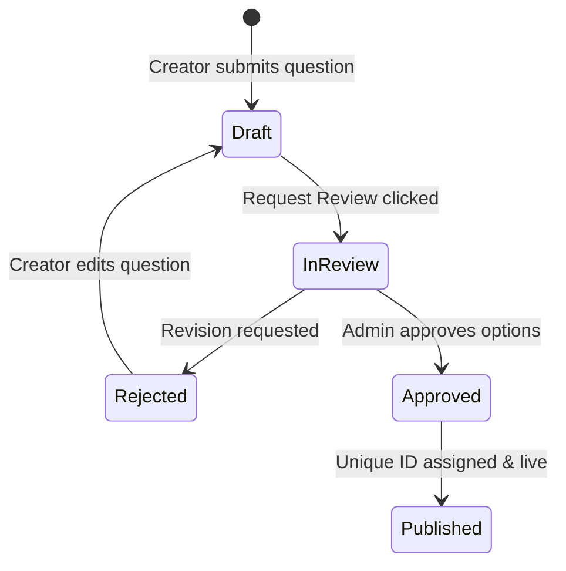

import { Cards, Callout } from 'nextra/components'

{/* Hero Header Banners */}

  

  

    

      Coordinator Console
    

    <h1 className="text-2xl font-black tracking-tight text-slate-900 dark:text-white my-0 leading-tight">
      Admin Portal
    </h1>
    

      Guides detailing questions database directories, curriculum domains models, cohort management logs, and creator authoring interfaces.
    

  

---

## Overview

Welcome to the Admin Portal section. This panel provides administrators, editors, and curriculum authors with editorial queues, user role assignment logs, cohort data charts, and direct question creation controls.

## Purpose

The main purpose of the Admin Portal is to enable content creators and editors to design, verify, and publish curriculum content. Incorporating verification steps and reviews workflow guarantees that student practices always reference high-quality questions.

## Architecture / Flow

Our administrative capabilities are built on top of secure database procedures and Next.js editor layouts:

  

    Table List
    Directory Grid
  

  

    WYSIWYG
    Content Editor
  

  

    Pending
    Review Queue
  

  

    Roles
    User Controls
  

## Data Flow

The state flowchart below maps the lifecycle that questions follow from initial creator draft to active publishing:

## Key Components

Select a guide section to explore:

<Cards>
  <Cards.Card icon="❓" title="Question Management" href="./question-management">
    Filters layout, database grid directory, search options, and Crockford Base32 keys.
  </Cards.Card>
  <Cards.Card icon="📁" title="Domain Management" href="./domain-management">
    Taxonomy configurations, domains updates, subtopics lists, and concept sequencing trees.
  </Cards.Card>
  <Cards.Card icon="👥" title="User Management" href="./user-management">
    Student registries list, academic search options, and administrative role updates.
  </Cards.Card>
  <Cards.Card icon="📈" title="Analytics" href="./analytics">
    Telemetry metrics charts, accuracy averages, and cohort solving counts.
  </Cards.Card>
  <Cards.Card icon="✏️" title="Create Question" href="./create-question">
    Form inputs, options mapping, and rich text visual configurations.
  </Cards.Card>
  <Cards.Card icon="🔄" title="Edit Question" href="./edit-question">
    Draft updates, formula correction, and tags modification.
  </Cards.Card>
  <Cards.Card icon="🚀" title="Publish Question" href="./publish-question">
    Verification constraints, visual key triggers, and committing updates.
  </Cards.Card>
  <Cards.Card icon="🎥" title="Upload Video" href="./upload-video">
    Video reference setups, duration indexes, and YouTube embed configurations.
  </Cards.Card>
  <Cards.Card icon="⚙️" title="Content Workflow" href="./content-workflow">
    Review processes, revision checks, and coordinator guidelines.
  </Cards.Card>
</Cards>

## Database Impact

The creator console contains a rich WYSIWYG markdown editor integrated with a KaTeX live preview. When a user updates question options, details are cached in client states before they are submitted via JSON payload to Next.js route handlers.

## Best Practices

<Callout type="warning">
  **Warning**: Always verify math syntax in the Live Preview device simulator before submitting the questions to the review queue.
</Callout>

<Callout type="info">
  **Permission Requirement**: Only authorized accounts with role `admin` or `editor` clear headers authorizations to request editor API updates.
</Callout>

## Related Documents

Related Reading:
- **[UI Components Directories](../components)**: Technical specs for `ContentEditor` and `LivePreview` elements.
- **[Database schemas tables](../database)**: Schema layout matching tables inputs.
- **[Student Platform Guides](../student-platform)**: Preview layouts matching student dashboards.
