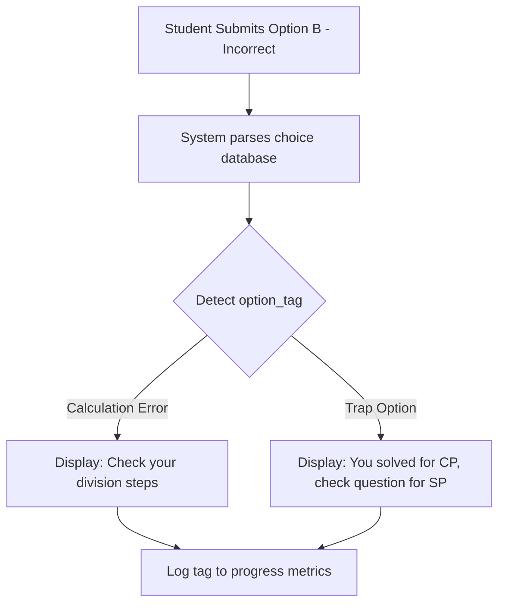

import { Callout } from 'nextra/components'

# AI Feedback

Learn how the system evaluates incorrect attempts, detects mathematical error pathways, and provides feedback messages.

---

  

    Reading Time
    3 min read
  

  

    Difficulty
    Advanced
  

  

    System
    Analysis
  

  

    Last Updated
    Jun 2026
  

---

### What You'll Learn

After reading this guide, you will understand:
✓ How the system parses your incorrect answer choices  
✓ Identifying the specific error pathway (miscalculation, setup error, trap)  
✓ Accessing context-specific hint messages  
✓ Lift metrics through error feedback loops  

---

## Why AI Feedback Exists

Simply showing a correct answer does not teach you *why you made a mistake*. The **AI Feedback** engine parses your incorrect submission option and maps it to a historical error pathway:
- **Calculation Error**: You set up the formula correctly but made a basic math error (e.g. addition/division).
- **Setup Error**: You misunderstood the problem constraints (e.g. treated circular arrangements as linear).
- **Trap Choice**: You selected a common trap option (e.g. calculated CP instead of SP).

---

## AI Feedback Analysis Loop

---

## Example Feedback Message

When practicing a percentage problem, you select Option B (48% instead of the correct 40%):

> 💡 **AI Feedback: Trap Option Alert**  
> *"You selected the net discount calculation before applying the markup multiplier. Check your second step: the markup increases the base to 120% before the 40% discount is applied."*

---

## AI Feedback Best Practices

<Callout type="info">
  **Best Practice: Keep an error log folder**  
  When the system flags a submission as a `Trap Option`, bookmark the question to a folder named `📂 Trap Questions`. Review this folder before taking mock tests to prevent repeating common errors.
</Callout>

<Callout type="warning">
  **Warning: Telemetry Limits**  
  Feedback analysis is only available for questions that have pre-mapped error metadata. For custom-created questions, the system provides standard written steps.
</Callout>

---

## Related Guides

* **[AI Mentor](../ai-features/ai-mentor)**
* **[AI ELI5 Guide](../ai-features/ai-eli5)**
* **[AI Insights](../ai-features/ai-insights)**
