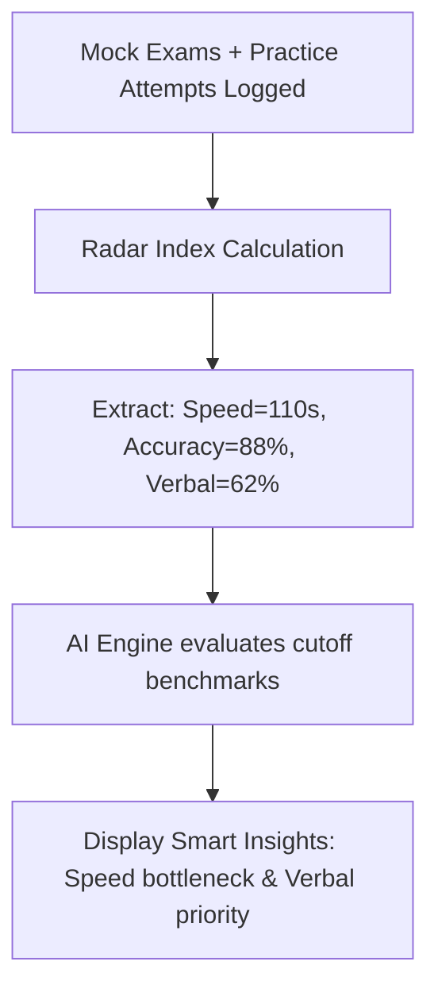

import { Callout } from 'nextra/components'

# AI Insights

Learn how the system evaluates your readiness index data, parses your historical solve counts, and generates smart insights.

---

  

    Reading Time
    3 min read
  

  

    Difficulty
    Advanced
  

  

    Module
    Analytics
  

  

    Last Updated
    Jun 2026
  

---

### What You'll Learn

After reading this guide, you will understand:
✓ Finding the AI Smart Insights panel on your profile page  
✓ How the system aggregates solve telemetry and timeline milestones  
✓ Identifying your core strength and bottleneck areas  
✓ Executing recommended prep changes to raise your index  

---

## Why AI Insights Exist

Readiness radar charts show *what* your levels are, but they don't explain *how* to raise them. **AI Smart Insights** analyze your metrics over time to extract specific strengths and action items:
- **Strength Recognition**: Identifies topic domains where your solve speed and accuracy exceed company benchmarks.
- **Weakness targeting**: Pinpoints subtopics causing your overall readiness index to sag.
- **Action items**: Generates concrete study steps (e.g. *Solve 10 Easy Syllogisms to build speed*).

---

## Data Analysis & Generation Loop

---

## Example Smart Insights Card

Displayed on your profile overview tab:

> 🧠 **AI Smart Insights**  
> - **Core Strength**: Outstanding accuracy in Quantitative Arithmetic ($88\%$). Keep maintaining consistency.
> - **Pacing Bottleneck**: Average solve speed on Logical Arrangements is $110$ seconds (limit: $90$ seconds). Practice Linear sequences under time pressure.
> - **Action Plan**: Focus on your **Verbal Mastery** path. Complete 15 error-spotting solves to raise your overall index.

---

## AI Insights Best Practices

<Callout type="info">
  **Best Practice: Review Insights weekly**  
  AI Smart Insights regenerate every Sunday at 00:00 IST based on your active weekly solve logs. Read the new insights card first thing on Monday morning to adjust your weekly study goals.
</Callout>

<Callout type="warning">
  **Warning: Data Prerequisites**  
  The engine requires at least 20 practice solves or 1 completed mock test before it can compile custom insights. New profiles display a foundational setup prompt.
</Callout>

---

## Related Guides

* **[AI Mentor](../ai-features/ai-mentor)**
* **[AI ELI5 Guide](../ai-features/ai-eli5)**
* **[AI Feedback](../ai-features/ai-feedback)**
