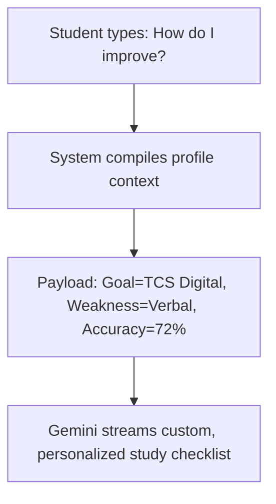

import { Callout } from 'nextra/components'

# AI Mentor

Learn how to interact with the AI Mentor, trigger contextual chat prompts, and request company preparation checklists.

---

### What You'll Learn

After reading this guide, you will understand:
✓ Launching the AI Mentor panel from your student dashboard  
✓ The context parameters fed to the LLM (profile details, target goals, weak nodes)  
✓ Asking for customized preparation check-lists  
✓ Troubleshooting study fatigue with guided advice  

---

## What is the AI Mentor?

The **AI Mentor** is a conversational assistant built directly into the platform. Instead of a general generic chatbot, the mentor has full context of your academic credentials, target company goals, active streak metrics, and readiness radar weakness segments.

---

## Chat Context Lifecycle

When you send a message, the system attaches a structured JSON payload to the Gemini API request context:

---

## Example Mentor Checklist Output

> **Targeted TCS Digital Study Plan**  
> *"Hello Vaishnavi! Since your goal is set to TCS Digital and your Verbal coordinate is currently at 58% (your weakest index), I suggest this focused checklist for today:*
> - *Spend 10 minutes on the **Verbal Error Spotting** concept sheet.*
> - *Solve 5 medium-difficulty grammar questions in the Practice Arena.*
> - *Save any incorrect items to a new folder named `📂 Verbal Revision`.*
> - *Avoid taking mock tests until your Verbal accuracy improves to 70%.*"

---

## AI Mentor Best Practices

<Callout type="info">
  **Best Practice: Ask for specific company interview questions**  
  Ask the mentor: *"What is the typical ratio question format used by Wipro?"* The mentor queries historical databases to explain common variations and solving shortcuts.
</Callout>

<Callout type="warning">
  **Warning: Conversational Scope**  
  The AI Mentor is optimized for interview preparation, mathematics, and logical sequencing. General off-topic queries (e.g. asking for recipe lists) are automatically flagged, and responses are redirected to preparation contexts.
</Callout>

---

## Related Guides

* **[AI ELI5 Guide](../ai-features/ai-eli5)**
* **[AI Feedback](../ai-features/ai-feedback)**
* **[AI Insights](../ai-features/ai-insights)**
