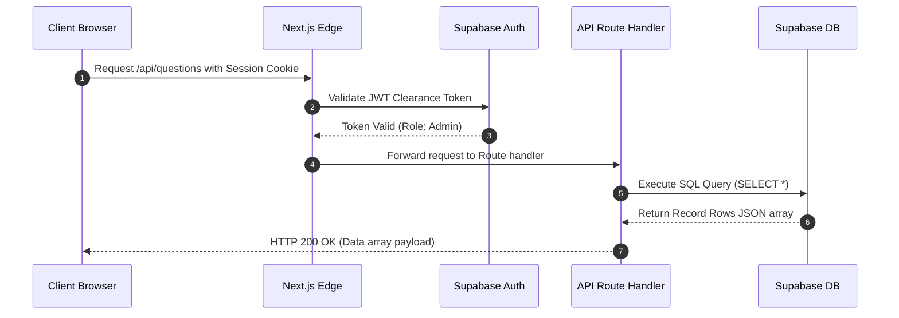

import { Cards, Callout } from 'nextra/components'

  

  

    

      API References
    

    <h1 className="text-2xl font-black tracking-tight text-slate-900 dark:text-white my-0 leading-tight">
      API Reference Specifications
    </h1>
    

      Technical guides detailing Next.js API route handlers, request-response payloads, status parameters, and validation constraints.
    

  

---

## Overview

Welcome to the API Reference Specifications section. This page compiles the HTTP endpoint definitions, JSON payloads schemas, input data validation criteria, and authorization policies that govern the communication layer of Base Institute.

## Purpose

The main purpose of our API is to provide a secure and standard interface for frontend clients to submit learner inputs and fetch administrative metrics. All endpoints validate inputs using TypeScript schemas and restrict execution based on session credentials.

## Architecture

Our endpoints are configured inside Next.js Route Handlers (App Router) and return JSON payloads:

  

    24+ Routes
    Endpoints Count
  

  

    JSON
    Exchange Format
  

  

    JWT Token
    Authorization
  

  

    RFC 7231
    HTTP statuses
  

## Data Flow

The diagram below tracks a standard authenticated transaction sequence:

## Components

Select an API reference guide to explore:

<Cards>
  <Cards.Card icon="🔐" title="Authentication API" href="./authentication-api">
    Endpoints managing logins, register forms, callback triggers, and onboarding steps saving.
  </Cards.Card>
  <Cards.Card icon="❓" title="Questions API" href="./questions-api">
    Question creator saves endpoints, review publishers, edits checkers, and options checklists.
  </Cards.Card>
  <Cards.Card icon="📁" title="Domains API" href="./domains-api">
    Retrieving domain curriculum index trees, subtopics tables, and conceptual nodes parameters.
  </Cards.Card>
  <Cards.Card icon="📊" title="Analytics API" href="./analytics-api">
    Solves counter tracking endpoints, streaking duration metrics, and leaderboard score registers.
  </Cards.Card>
</Cards>

## Implementation Notes

All routes enforce strict input validation using Zod. In case of invalid inputs, API handlers immediately reject requests with HTTP 400 Bad Request, returning a structured JSON array detailing the validation error paths and messages.

## Best Practices

<Callout type="warning">
  **Warning**: Always ensure that authentication cookies are passed via HTTPS-only cookies to prevent cross-site scripting (XSS) intercept risks.
</Callout>

<Callout type="info">
  **Note**: Endpoints returning paginated data lists should always specify default limit bounds to prevent database thread starvation.
</Callout>

## Related Links

Related Reading:
- **[Database Schemas Specs](../database)**: Schema layout matching endpoints response grids.
- **[Architecture Blueprints](../architecture)**: Overall pipeline workflows and token filters guides.
- **[Getting Started Variables Setup](../getting-started)**: API endpoints configuration variables.
