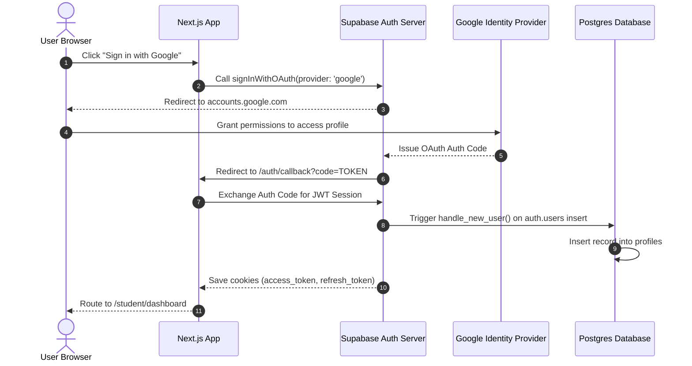

import { Callout } from 'nextra/components'

# Authentication Architecture

This page details the platform's identity validation, authorization workflows, role management, and Next.js middleware protection rules.

---

## Overview

The Kinetic Platform utilizes **Supabase Auth (GoTrue)** for secure identity management, storing user sessions in secure browser cookies. Next.js Edge middleware intercept routes at the network boundary, checking JWT permissions claims and enforcing onboarding state redirects before rendering dashboard shell layouts.

## Purpose

The main purpose of the security design is to protect user data from unauthorized access while maintaining a fast, low-latency client experience. Encapsulating session checking inside Edge Middlewares avoids expensive serverless API invocation delays for protected routes.

## Architecture / Flow

The platform supports both credentials (email/password) and social provider (Google OAuth) authentication vectors.

### Google OAuth Sequence Diagram
The sequence diagram below maps the token exchange, database trigger fires, and redirection loops during OAuth registration:



---

## Data Flow

Authenticating transactions execute as follows:
1. **Login Trigger**: The user submits credentials to Supabase Auth.
2. **Session Verification**: Supabase returns a JWT token containing role and user metadata.
3. **Cookie Storage**: The client saves cookies (`sb-access-token`, `sb-refresh-token`) with `HttpOnly` and `Secure` attributes.
4. **Middleware Protection**: Next.js Edge middleware checks incoming cookies on every route change, redirecting unauthenticated users to `/login`.

---

## Key Components

### 1. Edge Middleware (`middleware.ts`)
Interceptive routing rules:
- Checks if a valid Supabase session exists.
- Excludes public assets and authentication callbacks from protection.
- Validates the `onboarding_completed` flag on the user's profile. If `false`, redirects regular students to `/onboarding`.

### 2. Database Creation Trigger (`on_auth_user_created`)
Synchronizes authentication registries with relational profile records:
```sql
CREATE TRIGGER on_auth_user_created
  AFTER INSERT ON auth.users
  FOR EACH ROW EXECUTE FUNCTION public.handle_new_user();
```

---

## Database Impact

- **Table `auth.users`**: Supabase system table containing private credentials.
- **Table `profiles`**: Relational table storing username, email, active streaks, onboarding selections, and role authorization ranks (`student`, `editor`, `admin`).

---

## Best Practices

<Callout type="warning">
  **HttpOnly Cookies**: Always ensure that JWT credentials cookies are passed with `HttpOnly` configurations. This prevents JavaScript from reading raw tokens, shielding the platform from cross-site scripting (XSS) attacks.
</Callout>

---

## Related Documents

Related Reading:
- **[System Overview](../system-overview)**: Multi-tier architectural blueprints.
- **[Database Schema Specs](../../database)**: Schema layout of the `profiles` table.
- **[API References Guides](../../api)**: Registration, email verification, and recovery endpoints.

