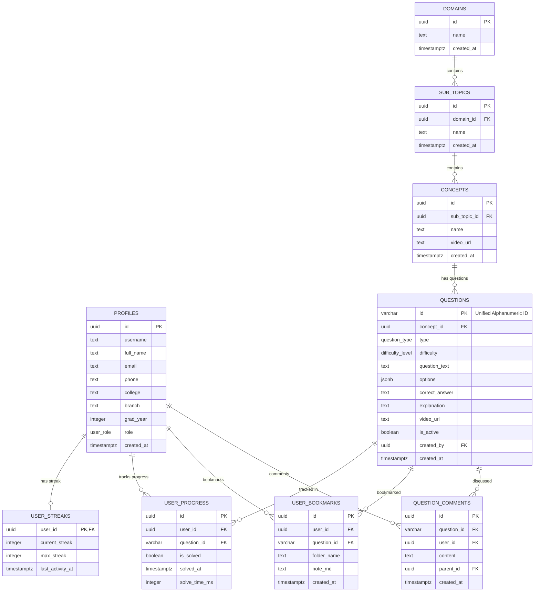

import { Callout } from 'nextra/components'

# Database Architecture

Detailed entity relationships, table breakdowns, foreign keys, and optimizations.

---

## Purpose

The main purpose of this module is to ensure system responsiveness, coordinate client events, and maintain relational integrity across data stores.

## Overview

This page provides an overview and technical specifications for the Database Architecture subsystem within Base Institute.

## Entity-Relationship Diagram (ERD)

---

## Core Table Segments

### 1. User Account Tables
- **`public.profiles`**: Stores user attributes, academic background, and access roles.
- **`public.user_streaks`**: Gamification ledger, tracking active streaks and all-time records.

### 2. Taxonomy & Question Tables
- **`public.domains`**, **`public.sub_topics`**, and **`public.concepts`**: Manages the course content hierarchy.
- **`public.questions`**: Stores question text, options, correct answers, and explanations.

### 3. Student Telemetry & Progress
- **`public.user_progress`**: Records which questions have been answered correctly, along with response times.
- **`public.question_attempts`**: Raw log of all question attempts, used to calculate candidate percentiles.
- **`public.learning_sessions`**: Tracks how long students spend viewing specific concepts.

### 4. Career Hub & Announcements
- **`public.opportunities`**: Career listings (jobs, internships, hackathons).
- **`public.announcements`**: Placement alerts and notice board items.

---

## Constraints & Cascades
- **`ON DELETE CASCADE`**: Automatically removes child records when a parent record is deleted (e.g. deleting a user deletes their progress logs, streaks, and bookmarks).
- **`ON UPDATE CASCADE`**: Propagates primary key updates across foreign key references (critical for visual alphanumeric ID updates).

> [!CAUTION]
> Avoid running un-indexed JOIN queries on progress tables to prevent performance issues with large datasets.

---

## Best Practices

<Callout type="info">
  **Best Practice**: Ensure that properties and state interfaces remain synchronized with type definitions across the workspace.
</Callout>

---

## Related Links

Related Reading:
- **[System Overview](../../architecture/system-overview)**: Multi-tier architectural blueprints.
- **[Getting Started](../../getting-started)**: Setup guide for local developers.
