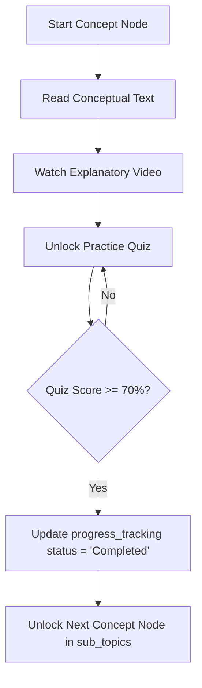

import { Callout } from 'nextra/components'

# Learning Engine Architecture

Technical design specs for lesson delivery, progression tracking, video analytics, and math rendering.

---


## Purpose

The main purpose of this module is to ensure system responsiveness, coordinate client events, and maintain relational integrity across data stores.

## Overview

This page provides an overview and technical specifications for the Learning Engine Architecture subsystem within the Kinetic Platform.

## Progression & Checkpoints Flow

To ensure students master preceding materials before advancing, the platform implements a structured learning flow:



- **Prerequisite Rules**: Subsequent concept nodes are locked until preceding nodes have a status of `Completed`.
- **Competency Verification**: Completing a concept quiz with at least **70%** accuracy is required to unlock the next lesson.

---

## Video Consumption Analytics
The platform tracks how much of a lesson video the student has watched to ensure they are actively studying:
- **Playback Tracking**: The video player dispatches telemetry (starts, pauses, completions) via `/api/student/activity`.
- **Completion Check**: Nextra tracks video progress. A concept is eligible for completion only after the student has viewed at least **80%** of the video.
- **Idling Prevention**: The duration tracking timer pauses automatically if the tab loses focus, preventing students from idling to complete lessons.

---

## Resume Learning Logic
- **Local Storage Cache**: On scroll or video pause events, the client updates the local storage cache (`aptitude_recent_activity`) with the `concept_id`, page scroll offset, and video progress timestamp.
- **Database Backup**: Session details are periodically saved to `public.progress_tracking`.
- **Dashboard Quick Link**: On login, the dashboard queries these logs to display the **"Resume Module"** card, letting students jump back into their lessons immediately.

---

## Math Notation (LaTeX)
Nextra 4 supports KaTeX natively to render complex mathematical formulas:

```math
f(x) = \int_{-\infty}^{\infty} \hat{f}(\xi)\,e^{2 \pi i x \xi}\,\mathrm{d}\xi
```

> [!NOTE]
> Prerequisite checkpoints and video tracking are validated server-side during API requests to prevent students from bypassing study requirements.

---

## Architecture

This component is integrated into the Next.js and Supabase tier, responding dynamically to API endpoints and schema constraints.

---

## Best Practices

<Callout type="info">
  **Best Practice**: Ensure that properties and state interfaces remain synchronized with type definitions across the workspace.
</Callout>

---

## Related Links

Related Reading:
- **[System Overview](../../architecture/system-overview)**: Multi-tier architectural blueprints.
- **[Getting Started](../../getting-started)**: Setup guide for local developers.
