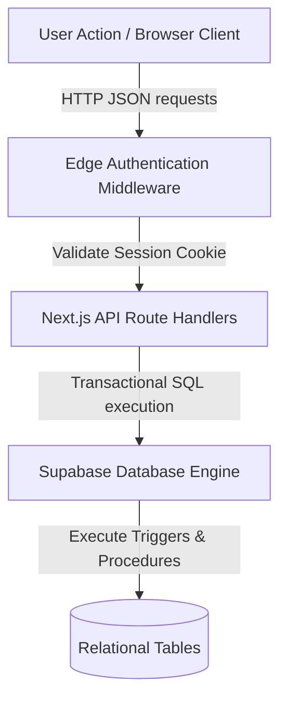

import { Cards, Callout } from 'nextra/components'

  

  

    

      Architecture Specs
    

    <h1 className="text-2xl font-black tracking-tight text-slate-900 dark:text-white my-0 leading-tight">
      Architecture Specifications
    </h1>
    

      Technical blueprints mapping platform subsystems, interactive transaction lifecycles, security edge middlewares, and scoring engine calculations.
    

  

---

## Overview

Welcome to the Architecture Specifications section of the Kinetic Platform. This area details the multi-tier engineering layout that integrates the frontend user interfaces, secure Edge authentication middleware, App Router API route handlers, and Supabase relational database instances.

## Purpose

The main architecture purpose is to establish an isolated, scalable structure that decouples UI rendering logic from data processing. By keeping security validation at the Edge and database integrity rules at the PostgreSQL layer, we ensure performance safety, real-time consistency, and auditability.

## Architecture

Platform components are categorized into frontend components, Edge authorizations middleware, Next.js handlers, and Supabase database services:

  

    3 Tiers
    Subsystems
  

  

    Edge Middleware
    Authorization Layer
  

  

    Crockford Base32
    Primary Keys
  

  

    15+ Models
    Flow diagrams
  

## Data Flow

The flowchart below maps request routing, validation cookies check, and transactional executions:

## Components

Select an architecture area to explore:

<Cards>
  <Cards.Card icon="📐" title="System Overview" href="./system-overview">
    Architecture layers, frontend packages, database layouts, and documentation setup.
  </Cards.Card>
  <Cards.Card icon="📊" title="User Journey Flows" href="./user-journey">
    Interactive flowcharts tracking Guests, Students, and Administrators paths.
  </Cards.Card>
  <Cards.Card icon="🔒" title="Authentication Architecture" href="./authentication">
    Google OAuth schemes, email verification triggers, session cookies, and edge middleware.
  </Cards.Card>
  <Cards.Card icon="💾" title="Database Architecture" href="./database">
    ERD maps, migrations directory, database triggers, index layouts, and constraints.
  </Cards.Card>
  <Cards.Card icon="🧠" title="Learning Engine" href="./learning-engine">
    Curriculum sequences, video tracking events, and LaTeX KaTeX formula rendering.
  </Cards.Card>
  <Cards.Card icon="🆔" title="Question Management" href="./question-management">
    Curriculum taxonomy hierarchy, visual Base32 key trigger logic, and review states.
  </Cards.Card>
  <Cards.Card icon="🖥️" title="Admin Panel" href="./admin-panel">
    Approval queues, domain editors, user permissions clearances, and statistics.
  </Cards.Card>
  <Cards.Card icon="📈" title="Student Dashboard" href="./student-dashboard">
    Dashboard SPA layouts, streaks calculators, levels calculations, and recommendations.
  </Cards.Card>
  <Cards.Card icon="🔮" title="Future Scalability Plans" href="./future-scalability">
    Database sharding guidelines, ML studies suggestions, and cohort challenge rules.
  </Cards.Card>
</Cards>

## Implementation Notes

Our platform architecture implements a **Serverless-First** approach. Static routes are pre-rendered at compile-time to reduce load times, while private pages (like dashboards and workflows) invoke dynamic client hooks directly querying Supabase with session authentication tokens.

## Best Practices

<Callout type="warning">
  **Important**: Keep edge database requests minimal. Running too many SQL calls in Next.js middleware blocks initial page paint cycles.
</Callout>

<Callout type="info">
  **Best Practice**: Ensure database schema constraints are synchronized with Zod validation parameters on Next.js API endpoint schemas.
</Callout>

## Related Links

Related Reading:
- **[Database Schemas Guides](../database)**: Schema overview, table maps, and migrations listings.
- **[API References Guides](../api)**: Detailed JSON payloads matching route handlers.
- **[Deployment specifications](../deployment)**: Pipeline checks, hosting guidelines, and environment check.
