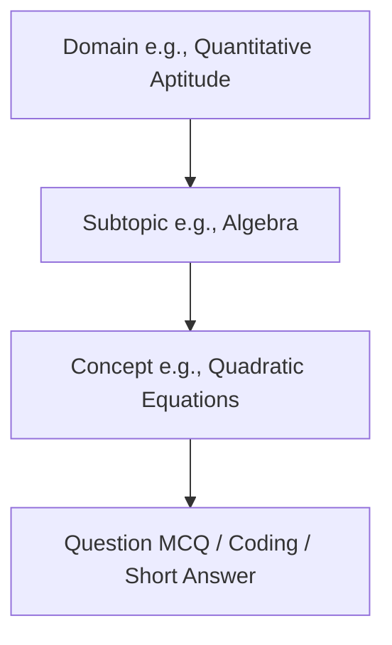
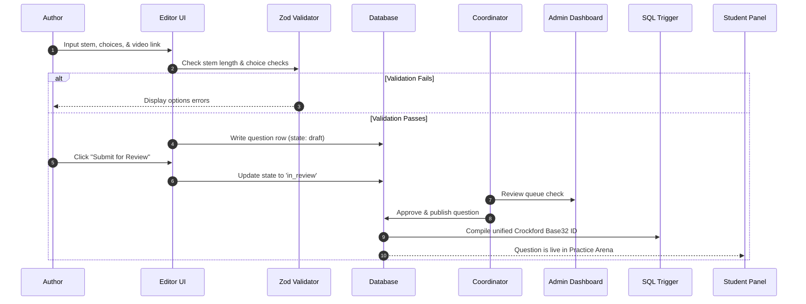

import { Callout } from 'nextra/components'

# Question Management Architecture

This page outlines the technical architecture, content taxonomy hierarchy, state machines, and primary key compiler schemas governing question records.

---

## Overview

The Question Management module coordinates the lifecycles, indexing structures, and validation rules for all pedagogical items in the database. It handles the hierarchical classification (Domain -> Subtopic -> Concept -> Question) and guarantees that every entry complies with database constraints and rendering standards.

## Purpose

The main purpose of this architecture is to provide content coordinators with strict editorial control over curriculum release. It prevents unverified questions from reaching the practice database and compiles visual identifiers that represent the logical taxonomy location of each question.

## Architecture / Flow

The taxonomy structures curriculum items into a strict four-level hierarchy to ensure logical organization:

### Question Creation & Review Flow
The sequence diagram below maps the steps to submit, review, validate, and publish a new question:

---

## Data Flow

Data states transitions during author actions:
1. **Draft Submit**: Draft payloads post to `/api/questions/save` (checks authentication and Zod layouts).
2. **State Updates**: Approval signals write to `/api/questions/publish` modifying columns `state = 'published'`.
3. **Trigger Cascade**: PostgreSQL `BEFORE INSERT OR UPDATE` trigger intercepts the transaction, reads the parent categories indexes, compiles the unique unified Crockford key, and writes the finalized row.

---

## Key Components

- `trigger_generate_questions_unified_id`: Stored PostgreSQL procedural function that runs before updates.
- `/src/components/ContentEditor.tsx`: Text and KaTeX preview client component.
- `/api/questions/save`: Serverless Next.js endpoint for question drafts.

---

## Database Impact

- **Table `questions`**: Primary target of writes. Tracks `state`, `unified_key`, and `domain_id` attributes.
- **Trigger `trigger_generate_questions_unified_id`**: Automatically compiles a human-readable visual primary key on question insertion. Format: `BBBB-BBBB-BBBB-BBBB` where each block represents a specific taxonomy index mapped using Crockford's letters (`ABCDEFGHJKMNPQRT`).

---

## Best Practices

<Callout type="warning">
  **RLS Cascade Guard**: Modifying a domain mapping index will trigger cascades recalculating visual primary keys for all child questions. Keep taxonomy structures static in production environments.
</Callout>

---

## Related Documents

Related Reading:
- **[System Overview](../system-overview)**: Multi-tier architectural blueprints.
- **[Content Creator Guide](../../content-creator)**: Details on difficulty parameters and versioning.
- **[Database Specs](../../database)**: DB table definitions mapping options.

