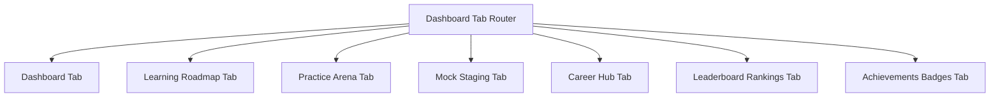

import { Callout } from 'nextra/components'

# Student Dashboard Architecture

Technical specifications for client-side state routing, daily streaks calculations, and dynamic widget integrations.

---

## Purpose

The main purpose of this module is to ensure system responsiveness, coordinate client events, and maintain relational integrity across data stores.

## Overview

This page provides an overview and technical specifications for the Student Dashboard Architecture subsystem within the Kinetic Platform.

## State Router Layout
The Student Portal is primarily designed as a high-fidelity Single Page Application (SPA) inside [src/app/student/dashboard/page.tsx](file:///Users/vaishu/Downloads/Base_Project/src/app/student/dashboard/page.tsx). It uses a centralized state router (`activeSidebarTab`) to switch views on the fly, ensuring a seamless user experience.

---

## Key Dashboard Engines

### 1. Streaks Engine
- **Streak Status Check**: On mount, the dashboard compares `last_activity_at` with the current timestamp (IST):
  - If the gap is **< 24 hours**, the streak is maintained.
  - If the gap is **between 24 and 48 hours**, the streak is incremented.
  - If the gap is **> 48 hours**, the streak is reset to `0`.
- **Database Logs**: Writes updates directly to the `public.user_streaks` table.

### 2. Continue Learning Logic
- **Concept Discovery**: Searches `public.progress_tracking` to find the most recently updated concept record marked `In Progress`.
- **Dashboard Preview**: Displays the lesson details, accuracy logs, and a **"Resume Module"** action that routes the user directly to the lesson node.

### 3. Career Hub Integration
- **Hiring Feed Grid**: Queries the `public.opportunities` database for active job and internship postings.
- **Verification Check**: Compares the student's domain competency scores with job requirements to determine eligibility before opening application links.

---

## Data Fetching Pattern
To ensure fast load speeds:
- Dashboard components fetch critical details (streaks, active profiles, and progress metrics) from local storage first to render the UI immediately.
- A background worker queries Supabase to fetch fresh data, silently updating the local storage cache and UI in the background.

> [!NOTE]
> Detailed user activity data is updated hourly to keep the dashboard responsive and fast.

---

## Architecture

This component is integrated into the Next.js and Supabase tier, responding dynamically to API endpoints and schema constraints.

---

## Best Practices

<Callout type="info">
  **Best Practice**: Ensure that properties and state interfaces remain synchronized with type definitions across the workspace.
</Callout>

---

## Related Links

Related Reading:
- **[System Overview](../../architecture/system-overview)**: Multi-tier architectural blueprints.
- **[Getting Started](../../getting-started)**: Setup guide for local developers.
