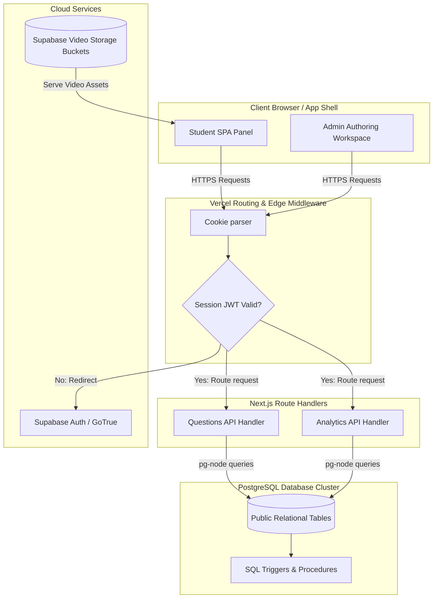

import { Callout } from 'nextra/components'

# System Overview

This page details the multi-tier enterprise architecture of Base Institute, outlining how client views, API handlers, authentication, and PostgreSQL databases synchronize.

---

## Overview

Base Institute implements a Serverless-First architecture designed for maximum performance, type safety, and real-time response. It coordinates client interactions from student web app panels and administrator workspaces, routing requests through secure Edge middlewares and API handlers to an enterprise PostgreSQL database cluster.

## Purpose

The main architecture purpose is to establish an isolated, scalable structure that decouples UI rendering logic from data processing. By maintaining strict validation checks on the frontend, role checks at the middleware tier, and database integrity rules at the PostgreSQL layer, we guarantee performance safety, auditability, and sub-second transaction times.

## Architecture / Flow

The diagram below details the end-to-end multi-tier system architecture:

---

## Architecture Layers

### 1. Frontend Layer
- **Core Technologies**: Next.js 16 (App Router), React 19, Tailwind CSS 4, Framer Motion, and Lucide React.
- **Responsibility**: Renders responsive dashboards, formats complex LaTeX formulas client-side with KaTeX, manages local client state, and triggers UI micro-animations during student streaks.

### 2. Backend / API Layer
- **Core Technologies**: Next.js Serverless Route Handlers.
- **Responsibility**: Exposes validated RESTful routes. Integrates Zod schemas to reject bad input before database execution.

### 3. Authentication Layer
- **Core Technologies**: Supabase Auth (GoTrue server) and Next.js Edge Middleware.
- **Responsibility**: Manages JWT credential tokens, routes social OAuth sign-ins, and intercepts routes to enforce role clearances (e.g. `admin` / `editor` / `student`).

### 4. Database Layer
- **Core Technologies**: PostgreSQL (via Supabase).
- **Responsibility**: Stores persistent application states. Enforces Row-Level Security (RLS) rules, coordinates database trigger functions, and compiles unified visual alphanumeric keys for curriculum indexing.

### 5. Storage Layer
- **Core Technologies**: Supabase Storage Buckets.
- **Responsibility**: Houses large public files including creator walkthrough videos, video explanations, and static assets.

---

## Data Flow

A standard read-write transaction lifecycle:
1. The **Client Browser** issues a signed API request to `/api/student/activity` containing a secure session cookie.
2. The **Edge Middleware** validates the JWT clearance token. If authenticated, the request is forwarded.
3. The **API Handler** validates payload structures using Zod.
4. The **API Handler** establishes a database connection and executes a query.
5. The **PostgreSQL Database** processes the query, triggers audit procedures, and returns the response payload.
6. The **Client Browser** receives the HTTP response and updates state metrics.

---

## Key Components

- `middleware.ts`: Intercepts client routing to check role settings.
- `src/components/ThemeToggle.tsx`: Client controller adjusting Tailwind themes.
- `/api/student/activity/route.ts`: API router parsing solving streaks.
- `/api/questions/save/route.ts`: Authoring route validating inputs.

---

## Database Impact

The frontend and API handlers interact directly with database tables, with all queries restricted by PostgreSQL RLS configurations based on the calling user's UUID. Stored procedures automatically handle calculations for levels, XP increments, and streak resets.

---

## Best Practices

<Callout type="info">
  **Best Practice**: Keep serverless handlers stateless. Always pool database connections to avoid exhaustion under high concurrent student practice loads.
</Callout>

---

## Related Documents

Related Reading:
- **[Database Schema Overview](../../database/schema-overview)**: Entity-relationship mappings and migrations guides.
- **[API References Guides](../../api)**: Route configurations and request-response JSON schemas.
- **[Getting Started Setup Guide](../../getting-started)**: Setting up local PostgreSQL connections.

