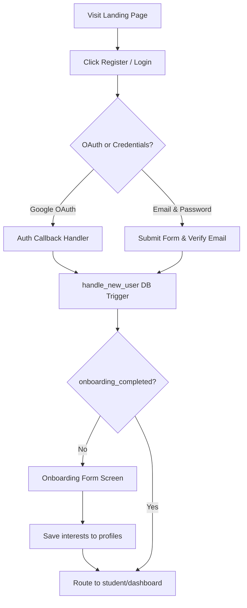
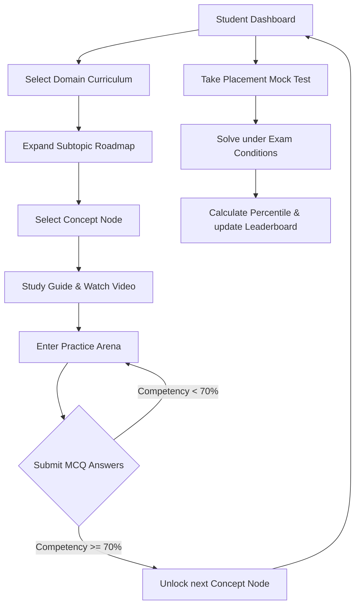
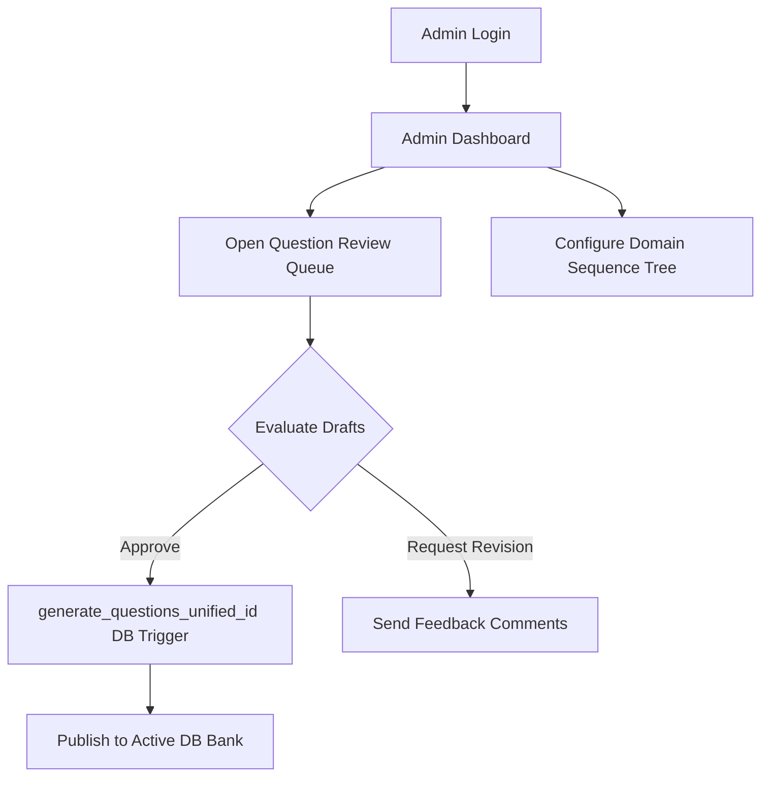

import { Callout } from 'nextra/components'

# User Journey Flows

This page details the functional user journeys, navigation loops, and structural state-changes for Guests, Students, and Administrators.

---

## Overview

The user journeys on Base Institute are modeled as sequential states that map directly to user sessions, permissions clearances, and database records. The system orchestrates these journeys client-side using Next.js routing and server-side using relational database triggers.

## Purpose

The main purpose of structuring these journeys is to guarantee a friction-free onboarding path for learners while enforcing access constraints for administrative features. Clear visual mapping ensures developers understand how onboarding wizard screens, practice arenas, and administrative review consoles connect.

## Architecture / Flow

Detailed state transitions mapping how different roles interact with the application subsystems:

### 1. Guest & Onboarding Journey
New visitors sign up, pass through authentication loops, and fill out the onboarding preferences questionnaire:

### 2. Student Learning Journey
The primary study, practice, and diagnostic loop of the student platform:

### 3. Administrator & Content Journey
The editorial queue and content management paths for coordinators:

---

## Data Flow

User journey state changes follow these sequential transactions:
1. **Onboarding Complete**: The frontend posts user interests payload to `/api/auth/verify`.
2. **Database Update**: The API updates the user profile record setting `onboarding_completed = true`.
3. **Session Reset**: The middleware intercepts the success callback, registers the new session permissions claims, and redirects the client to the student dashboard.

---

## Key Components

- `/app/onboarding/page.tsx`: Wizard form collecting initial user interests.
- `/app/student/dashboard/page.tsx`: Single Page Application (SPA) container hosting progress charts.
- `/app/admin/dashboard/page.tsx`: Coordinator telemetry console tracking review queues.

---

## Database Impact

User journeys directly write telemetry logs, profile states, and solve counts:
- **Attempts**: Solves in the practice arena insert rows into `progress` to track accuracy.
- **Profiles**: Onboarding answers populate interest arrays and department tags.
- **Audit Logs**: Role switches and approvals write records to admin trace history.

---

## Best Practices

<Callout type="warning">
  **Onboarding Locks**: Ensure that the student dashboard router rejects any student session where `onboarding_completed` is false, redirecting them back to the onboarding wizard.
</Callout>

---

## Related Documents

Related Reading:
- **[System Overview](../system-overview)**: Multi-tier architectural blueprints.
- **[Student Platform Overview](../../student-platform)**: Details on the practice arena and telemetry.
- **[Admin Portal Overview](../../admin-portal)**: Question review queues and editor configurations.

