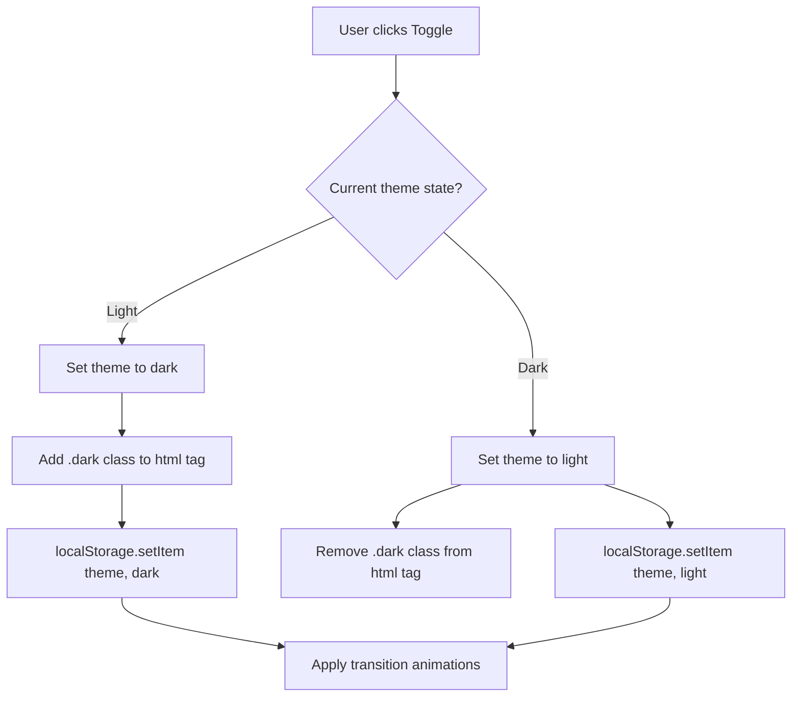

import { Callout } from 'nextra/components'

# Core Shared Components

This section details the design, props, states, and logic flow of the primary shared UI components that are reused across multiple screens in Base Institute.

---


## Overview

This page provides an overview and technical specifications for the Core Shared Components subsystem within Base Institute.

## 1. ThemeToggle

The `ThemeToggle` component allows users to switch between light and dark modes. It is client-side rendered, integrates with tailwind-free CSS custom properties, and includes features to completely eliminate layout shifts during server-side rendering hydration.

### Purpose
To provide a smooth visual transition between light and dark UI themes by toggling the `.dark` class on the `<html>` element and caching the preference in `localStorage`.

### Location in Codebase
- File: [ThemeToggle.tsx](file:///Users/vaishu/Downloads/Base_Project/src/components/ThemeToggle.tsx)

### Props Interface
```typescript
interface ThemeToggleProps {
  floating?: boolean; // If true, renders as a floating round FAB button instead of a header inline box.
}
```

### State Management
- `theme`: `'light' | 'dark'` - Tracks the currently active client theme.
- `mounted`: `boolean` - Set to `true` on the client-side `useEffect` hook to prevent React server-hydration layout mismatches.

### API Dependencies
- None.

### Database Dependencies
- None.

### User Flows
1. **Hydration Phase**: The page loads. While `mounted` is false, a skeleton size-matching layout preview is rendered.
2. **Mount Phase**: `useEffect` executes, checks `document.documentElement.classList.contains('dark')`, updates `theme` state, and sets `mounted` to true.
3. **Toggle Event**: The user clicks the button.
   - `document.documentElement` is decorated with `.theme-transitioning` (enables CSS transition timing parameters).
   - Theme changes to the opposing state (`light` to `dark` or vice-versa).
   - `.dark` class is added/removed from `<html>`.
   - Local caching writes `'dark'` or `'light'` to `localStorage.setItem('theme', value)`.
   - A `setTimeout` removes `.theme-transitioning` after 500ms once animations settle.



### Visual Layout Preview
```
+------------------------------------+
| [ ] Toggle Switch (Sun/Moon icon)  |
+------------------------------------+
```

### Future Improvements
- Synchronize UI states with OS system settings preferences by using a media query listener (`prefers-color-scheme`).

---

## 2. BentoCard

The `BentoCard` component is a high-end visual container implementing dynamic 3D tilting hover effects and spotlight radial gradients. It is built as a layout primitive for dashboard elements.

### Purpose
Provides a premium visual design language inspired by Stripe and Notion dashboard cards, responding to cursor coordinates with dynamic CSS custom properties.

### Location in Codebase
- File: [BentoCard.tsx](file:///Users/vaishu/Downloads/Base_Project/src/components/BentoCard.tsx)

### Props Interface
```typescript
interface BentoCardProps {
  children: React.ReactNode; // Content inside the card wrapper.
  className?: string;        // Optional class configurations to adjust height/width layouts.
  delayIndex?: number;       // Cascade index used to offset entrance translation animations.
}
```

### State Management
- `coords`: `{ x: number, y: number }` - Tracks normalized coordinates relative to the card's center (`-0.5` to `0.5`).
- `isHovered`: `boolean` - True when cursor is hovering over the card.
- `isVisible`: `boolean` - True when the card enters the viewport (tracked by IntersectionObserver).

### API Dependencies
- None.

### Database Dependencies
- None.

### User Flows
1. **Scroll-In Entrance**: An `IntersectionObserver` detects the card inside the viewport, flipping `isVisible` to true, triggering a transition translation that offsets with `delayIndex * 150ms`.
2. **Cursor Hover**:
   - `onMouseEnter` activates hover state.
   - `onMouseMove` calculates the bounding box client rect.
   - Normalized values are computed to update CSS variables `--mouse-x` and `--mouse-y` dynamically.
   - 3D perspective rotation values (`rotateX`, `rotateY`) are applied via inline transform styles.
3. **Cursor Exit**: `onMouseLeave` resets coordinates to zero, smoothly returning card rotation angles to baseline via transitions.

### Visual Layout Preview
```
+-------------------------------------------------+
|               Spotlight Border Glow             |
|                                                 |
|  [Card Content: e.g. Continue Learning / Stats]  |
|                                                 |
|                               <- Hover-tilt ->  |
+-------------------------------------------------+
```

### Future Improvements
- Support disable flags for performance optimization on lower-end devices or when users configure reduced-motion OS parameters.

---

## Architecture

This component is integrated into the Next.js and Supabase tier, responding dynamically to API endpoints and schema constraints.

---

## Best Practices

<Callout type="info">
  **Best Practice**: Ensure that properties and state interfaces remain synchronized with type definitions across the workspace.
</Callout>

---

## Related Links

Related Reading:
- **[System Overview](../../architecture/system-overview)**: Multi-tier architectural blueprints.
- **[Getting Started](../../getting-started)**: Setup guide for local developers.
