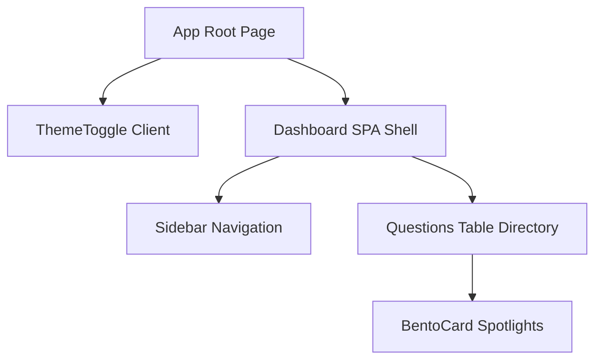

import { Cards, Callout } from 'nextra/components'

  

  

    

      Components Registry
    

    <h1 className="text-2xl font-black tracking-tight text-slate-900 dark:text-white my-0 leading-tight">
      Components Registry
    </h1>
    

      Technical directories of React elements, TypeScript props interfaces, component state properties, and layout containers.
    

  

---

## Overview

Welcome to the Components Registry section. This directory compiles the modular React UI components, layout templates, onboarding wizards, and visual editor widgets that build the client application of Base Institute.

## Purpose

The main purpose of our component architecture is to promote reuse, visual consistency, and type safety across student and administrator platforms. Decoupling visual primitives like `BentoCard` from page routing logic allows rapid front-end experimentation.

## Architecture

Our visual library utilizes React 19, tailwindcss 4, Framer Motion animations, and Lucide react icons:

  

    2 Core
    Shared primitives
  

  

    WYSIWYG
    Markdown editor
  

  

    KaTeX Math
    Pre-render Preview
  

  

    14+ Views
    Route panels
  

## Data Flow

The layout tree below maps the inheritance and nesting paths of client views:

## Components

Select a component area to explore:

<Cards>
  <Cards.Card icon="🧱" title="Core Components" href="./core">
    Shared container details: `BentoCard` spotlights tilting styles, and `ThemeToggle` controllers.
  </Cards.Card>
  <Cards.Card icon="👤" title="Student Screens" href="./student">
    Authentication panels, onboarding forms, student dashboard SPA, and domain dashboards.
  </Cards.Card>
  <Cards.Card icon="⚙️" title="Admin Layout" href="./admin-layout">
    Admin sidebars, role switcher headers, and directory table components.
  </Cards.Card>
  <Cards.Card icon="📝" title="Admin Editor" href="./admin-editor">
    Visual editors, LivePreview device simulators, selectors, and option matrices.
  </Cards.Card>
  <Cards.Card icon="💻" title="Admin Screens" href="./admin-screens">
    Metrics trackers, settings consoles, user logs, and gamification badge editors.
  </Cards.Card>
</Cards>

## Implementation Notes

All UI controls are declared inside the `src/components` tree. Primitives are written using Tailwind classes, with custom animations declared inside Framer Motion wrappers. Math formatting is rendered client-side using the `katex` package.

## Best Practices

<Callout type="warning">
  **Important**: Keep client components lean. Add `"use client"` directive only to files that utilize React hooks or event listeners.
</Callout>

<Callout type="info">
  **Props Standard**: All shared React components must enforce strict TypeScript interfaces. Check typings before integrating them inside layouts.
</Callout>

## Related Links

Related Reading:
- **[Student Platform Overview](../student-platform)**: Screen metrics logic and progress parameters.
- **[Admin Portal Overview](../admin-portal)**: Question workflow tables configurations.
- **[Database tables guides](../database)**: Schema layout matching tables inputs.
