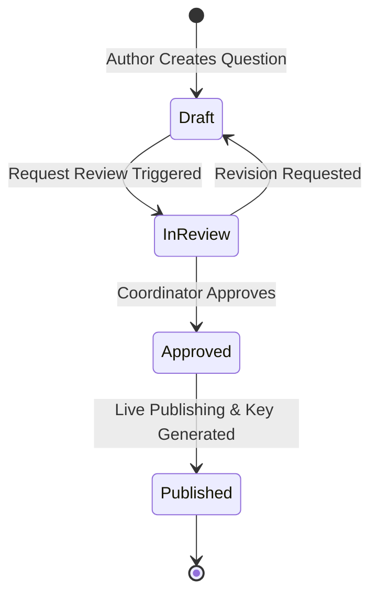
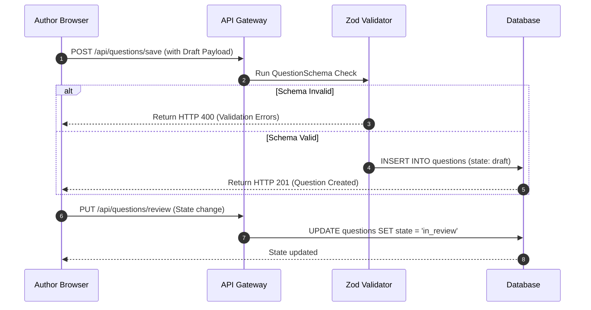

import { Callout } from 'nextra/components'

# Content Creator Guide

This guide details the authoring workflow, metadata schemas, validation criteria, and release cycle that govern the creation of curriculum questions on the Kinetic Platform.

---

## Overview

The Content Creator system provides administrators and content authors with specialized UI workspaces to write academic questions, align them with curriculum domains, embed explanation videos, assign tag taxonomies, and manage review pipelines. 

## Purpose

The main purpose of the Content Creator module is to establish a secure and audit-compliant editorial pipeline. By ensuring that every question goes through multiple states (Draft, In-Review, Approved, Published) and is validated against rigorous schemas, we maintain high pedagogical quality and eliminate broken questions or invalid LaTeX formats.

## Architecture / Flow

Questions flow through a strict state machine from initial creation to production publishing:

### The Lifecycle States:
1. **Draft**: The question is editable only by its creator or administrators. It is not visible to students and does not count towards domain metrics.
2. **In-Review**: The question is locked from editing by the author. Content managers and coordinators review it for clarity, math accuracy, and schema correctness.
3. **Approved**: The question passes review. It is locked in its finalized state, awaiting scheduled release or instant publishing.
4. **Published**: A unique unified primary key (Crockford Base32 format) is generated, RLS flags make it visible to students, and it goes live in the practice arena.

---

## Data Flow

The flow of database states and API validation checks during question authoring:

---

## Key Components

### 1. Question Schema Validation
Every question must satisfy the strict Zod validator schema before database write:
- **unified_key**: Automatically compiled Crockford Base32 key when published.
- **stem**: Detailed text description (supports KaTeX/LaTeX formatting).
- **options**: Options matrix (an array of JSON objects). Must contain exactly 4 options, and precisely 1 option marked as `is_correct: true`.
- **domain_id**: Reference key mapping the question to a valid curriculum domain.
- **difficulty**: Enumerated level (`easy`, `medium`, `hard`).

### 2. Video Schema Specification
Video explanations are hosted on Supabase Storage and referenced in the metadata:
- **video_url**: Verified YouTube embed URL or public cloud storage asset link.
- **duration**: Duration indexes in seconds for analytics tracking.
- **chapters**: An array of time-stamps (JSON format) detailing step-by-step solutions.

### 3. Difficulty Rules
Adjusts the adaptive engine calculations:
- **Easy**: Core definitions and basic calculations. Renders first during diagnostic checks.
- **Medium**: Multi-step reasoning or algebraic transformations.
- **Hard**: Complex word problems or advanced mathematical proofs requiring structural layout diagrams.

---

## Database Impact

The Content Creator system interacts with the following database entities:

| Table | Dependency Type | Key Actions |
|---|---|---|
| `questions` | Primary | Insert/Update question body, unified key, and state checks |
| `domains` | Parent Reference | Foreign Key check on `domain_id` to establish taxonomy |
| `profiles` | Author Reference | Tracks `created_by` author UUID and audit controls |
| `progress` | Child Reference | Resolves cascade updates if a question is deprecated |

---

## Best Practices

<Callout type="warning">
  **LaTeX Preview Rule**: Content authors MUST verify LaTeX expressions in the visual live simulator before requesting a review. Broken LaTeX syntax will block compile-time static page pre-rendering.
</Callout>

<Callout type="info">
  **Tag Standards**: Ensure every question includes at least one subtopic tag and difficulty alignment to enable accurate recommendations by the student's adaptive learning engine.
</Callout>

---

## Related Documents

Related Reading:
- **[Admin Portal Guides](../admin-portal)**: Workflow tables and approval queue dashboard layouts.
- **[Database schemas tables](../database)**: Database triggers compiling Base32 keys.
- **[API References Guides](../api)**: Detailed specifications of route request bodies.
