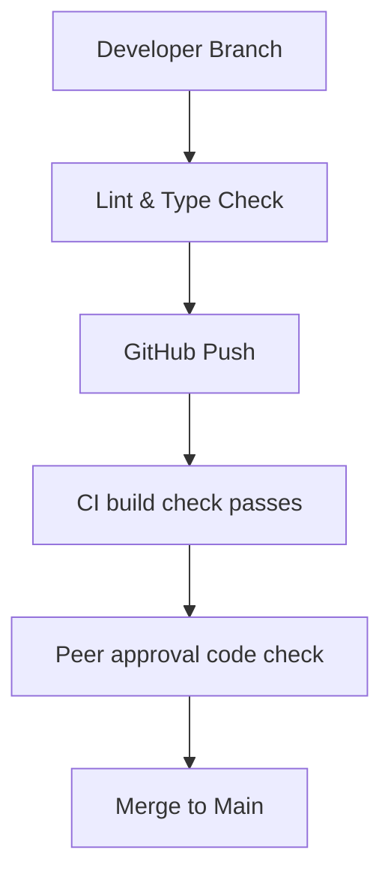
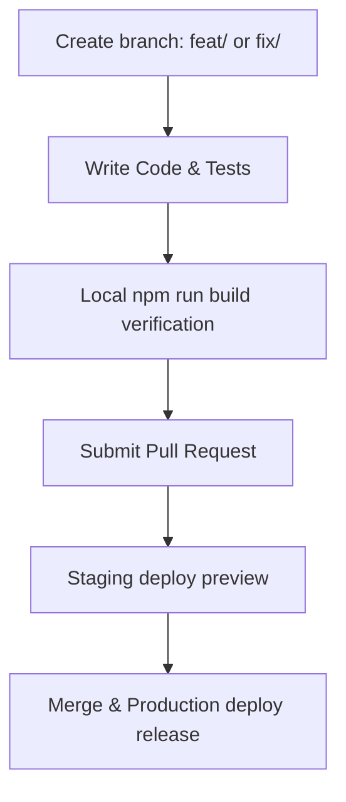

import { Callout } from 'nextra/components'

# Contributing Guide

Guidelines and instructions for branching, code styling standards, commit conventions, and proposing pull requests.

---

## Overview

Welcome to the Contributing Guide. This document establishes standards and workflows for developers, technical writers, and designers submitting code changes to the Kinetic codebase.

## Purpose

The main purpose of these conventions is to maintain codebase readability, verify visual and functional regression checks, and automate release pipelines.

## Architecture / Flow

Our development workflow runs through GitHub and automated pipeline checkers:



## Data Flow

The flow chart below displays the checklist matching branches to production releases:



## Key Components

Follow these standards when preparing contributions:

### 1. Branching Strategy

We use a feature-branch workflow. All work should be done on branches branched off of `main` (or the current release branch) and named with a clear prefix:

- `feat/feature-description`: For new features (e.g., `feat/auth-google-oauth`).
- `fix/bug-description`: For bug fixes (e.g., `fix/streak-timezone-offset`).
- `docs/page-description`: For documentation (e.g., `docs/contributing-standards`).
- `refactor/refactor-description`: For code cleanups (e.g., `refactor/dashboard-state`).
- `perf/improvement-description`: For performance improvements (e.g., `perf/query-indexing`).

Example branching workflow:
```bash
# Fetch latest updates from main
git checkout main
git pull origin main

# Create and switch to a new feature branch
git checkout -b feat/add-activity-logger
```

### 2. Commit Standards (Conventional Commits)

We enforce the [Conventional Commits specification](https://www.conventionalcommits.org/). This structures commit logs, making them easy to read and enabling automated versioning.

Format:
`<type>(<scope>): <description>`

*   **Types**: `feat` (new feature), `fix` (bug fix), `docs` (docs only), `style` (formatting/linting), `refactor` (code restructuring), `test` (adding tests), `chore` (build tasks/deps).
*   **Scope**: Optional, represents the affected module (e.g., `auth`, `api`, `dashboard`).
*   **Description**: Short, imperative mood, lowercase, no period.

Examples:
- `feat(auth): integrate google oauth token exchange`
- `fix(db): add row-level security policy for guest users`
- `docs(api): update rate limits on questions endpoints`
- `style(components): run eslint fix on button component`

### 3. PR Templates & Process

When submitting a Pull Request, use the standard template below to document your changes.

```markdown
## Description
Provide a clear description of what this PR introduces and why.

## Related Issues
Closes # [Issue number]

## Type of Change
- [ ] Bug fix (non-breaking change which fixes an issue)
- [ ] New feature (non-breaking change which adds functionality)
- [ ] Breaking change (fix or feature that would cause existing functionality to not work as expected)
- [ ] Documentation update

## Verification Checklist
- [ ] Ran `npm run lint` and resolved all errors
- [ ] Ran `npm run build` locally and compiled successfully
- [ ] Verified routing, search, and navigation render correctly
```

### 4. Code Review Cycles

All PRs require at least one peer approval from the engineering team before they can be merged.

*   **Checklist for Reviewers**:
    *   **Correctness**: Does the code fulfill the functional requirements?
    *   **Typesafety**: Are TypeScript types clean and free of `any` types?
    *   **Security**: Are client calls properly checking user authorization tokens?
    *   **Performance**: Are database requests batched, or are there N+1 query loops?
    *   **Documentation**: Are new endpoints or components properly documented in the MDX portal?

### 5. QA Release Cycles

Once approved, branches are merged to the `main` branch. This triggers our deployment pipeline.

*   **Staging Verification**: Deployed automatically to the staging server. Product managers and QA engineers test features manually.
*   **Production Deployment**: Release tags are created weekly. Production deploys require successful execution of all automated tests, security scans, and a verified green light on staging regression suites.

---

## Database Impact

Contributions altering the database structure must include SQL migration scripts under `supabase/migrations/` to guarantee schema parity between developer sandboxes and live databases.

---

## Best Practices

<Callout type="warning">
  **Release Rule**: Never merge a branch that fails compile type-checks or linting validations.
</Callout>

<Callout type="info">
  **Code Reviews**: Propose small, modular pull requests rather than massive changes. This accelerates reviews and simplifies code audits.
</Callout>

---

## Related Documents

Related Reading:
- **[Getting Started guide](../getting-started)**: Local installation steps checklist.
- **[Deployment Specifications](../deployment)**: Pipeline triggers specifications.
- **[System Overview](../architecture/system-overview)**: Overall subsystems details.
- **[Troubleshooting Guide](../troubleshooting)**: Pre-release check validation debugs.
