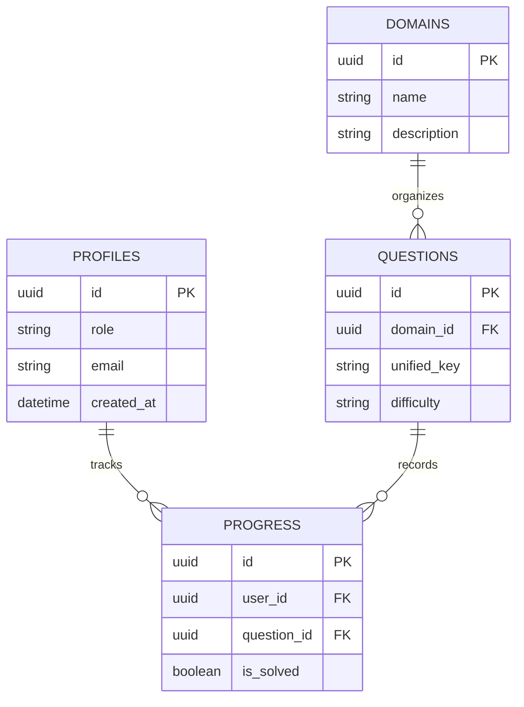

import { Cards, Callout } from 'nextra/components'

  

  

    

      Database Specifications
    

    <h1 className="text-2xl font-black tracking-tight text-slate-900 dark:text-white my-0 leading-tight">
      Database Schema Specifications
    </h1>
    

      Detailed guides for Supabase schemas, profiles registrations, questions matrices, RLS policies, indexing guidelines, and PostgreSQL database triggers.
    

  

---

## Overview

Welcome to the Database Schema Specifications section. This page serves as the entry point for the relational model, tables definitions, Row-Level Security policies, PostgreSQL triggers, and schema migrations that govern the data storage tier of Base Institute.

## Purpose

The main purpose of our database design is to enforce strict transaction-level integrity rules at the PostgreSQL engine level. Using native RLS policies, we ensure that user profile data, solved question counters, and streak indices are protected against unauthorized queries and tampering.

## Architecture

Our data structure is built on a Supabase PostgreSQL instance using custom schemas and relational models:

  

    16 Tables
    Schema tables
  

  

    8 Triggers
    Stored Procedures
  

  

    Enforced
    Row-Level Security
  

  

    Supabase SQL
    DB Provider
  

## Data Flow

The Entity-Relationship Diagram below maps the relations, primary keys, and cascade paths of the core entities:

## Components

Select a database schema subpage to explore:

<Cards>
  <Cards.Card icon="💾" title="Schema Overview" href="./schema-overview">
    Entity relationship diagrams, base schemas, triggers, indexes, and migrations checklists.
  </Cards.Card>
  <Cards.Card icon="👤" title="Profiles Table" href="./profiles-table">
    User profiles data details, role credentials, and automated signup database triggers.
  </Cards.Card>
  <Cards.Card icon="❓" title="Questions Table" href="./questions-table">
    Question stems schemas, choices JSON structures, visual alphanumeric keys, and difficulty filters.
  </Cards.Card>
  <Cards.Card icon="📁" title="Domains Table" href="./domains-table">
    Curriculum domain indices, sub-topic descriptions, and conceptual sequencing parameters.
  </Cards.Card>
  <Cards.Card icon="📈" title="Progress Table" href="./progress-table">
    Student solving logs, streak calculations parameters, and badges credentials.
  </Cards.Card>
  <Cards.Card icon="📝" title="Migrations Directory" href="./migrations">
    Chronological migrations log files tracking tables, triggers, and indices adjustments.
  </Cards.Card>
</Cards>

## Implementation Notes

Our PostgreSQL schema uses a custom database trigger `trigger_generate_questions_unified_id` which automatically compiles a human-readable visual primary key on question insertion. All tables reside in the default `public` database schema, with audit logs saved inside the `auth` schemas.

## Best Practices

<Callout type="warning">
  **Warning**: RLS must remain enabled on all tables. Never disable Row-Level Security in a production migration script.
</Callout>

<Callout type="info">
  **Best Practice**: Ensure that all query routes query the tables through indexed columns (e.g. `user_id`, `question_id`, `domain_id`) to maintain sub-second retrieval speeds under heavy traffic.
</Callout>

## Related Links

Related Reading:
- **[Architecture Database details](../architecture/database)**: Stored procedures logic and SQL trigger blueprints.
- **[API Reference Specifications](../api)**: Query schemas matching tables interfaces.
- **[Deployment Specifications](../deployment)**: Initial database variables setups.
