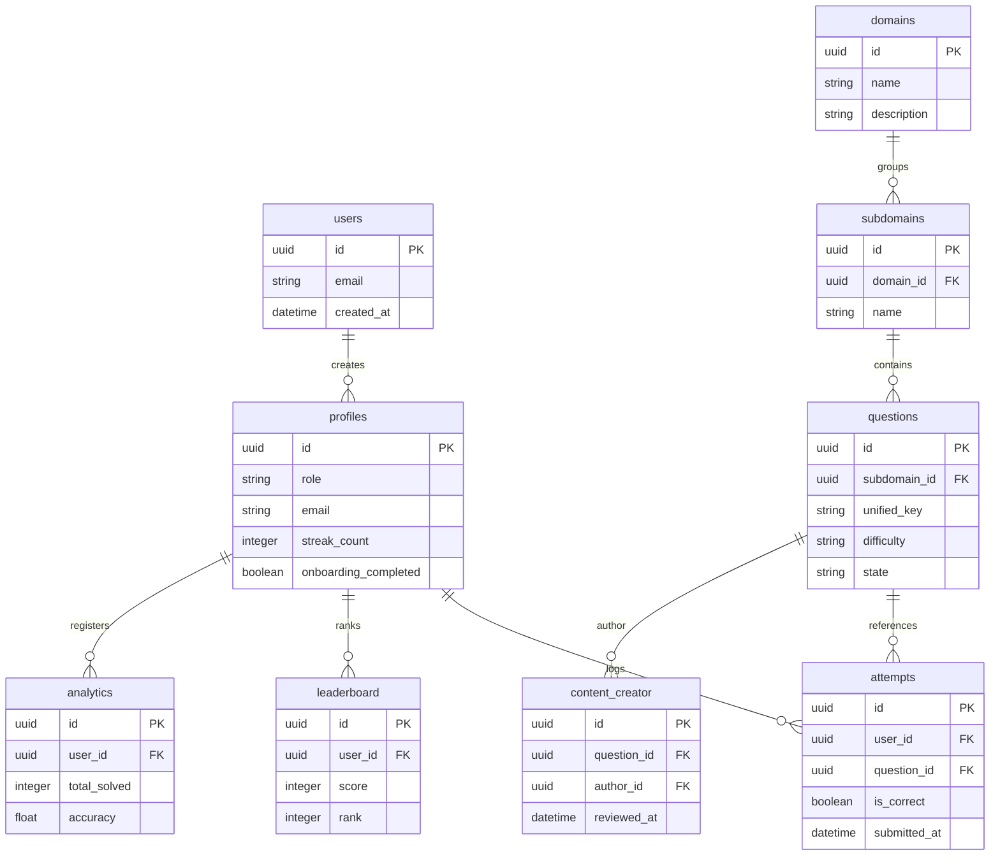

import { Callout } from 'nextra/components'

# Schema Design & RLS Policies

This page details the PostgreSQL relational schemas, Entity-Relationship mappings, performance indexing, stored triggers, and Row-Level Security policies.

---

## Overview

The database tier of the Kinetic Platform is built on top of **Supabase PostgreSQL**. It manages data structures across multiple core areas: user accounts, curriculum domain hierarchies, student solving progress tracking, leaderboard rankings, and creator authoring flows. Relational integrity is enforced at the database level using cascades, triggers, and foreign keys.

## Purpose

The main purpose of our database design is to guarantee transaction safety and isolate user data at the database engine level. Implementing Row-Level Security (RLS) policies ensures that students can read and write only their own records, preventing unauthorized data inspection or cross-tenant query leaks.

## Architecture / Flow

### Entity-Relationship Diagram
The diagram below details the tables relations, primary/foreign keys, and cascade pathways for the core platform models:

---

## Data Flow

Transactions write database tables through these sequences:
1. **User Solves MCQ**: Client browser posts solutions.
2. **Attempts Insert**: Row inserts into the `attempts` table.
3. **Trigger Fires**: `trigger_update_user_stats` intercept, recalculating the total solved questions and accuracy averages, and upserts the result into the `analytics` and `leaderboard` tables.
4. **Streak Calculation**: Stored procedures compare the difference between current and last solve timestamps, incrementing or resetting `profiles.streak_count` accordingly.

---

## Key Components

### 1. Row-Level Security (RLS) Policy Table

| Table Name | SELECT Policy | INSERT/UPDATE Policy | Security Scope |
| :--- | :--- | :--- | :--- |
| `public.profiles` | `USING (true)` (Public read) | `USING (auth.uid() = id)` | Owner write access. |
| `public.attempts` | `USING (auth.uid() = user_id)` | `USING (auth.uid() = user_id)` | Restricts reads/writes to owner. |
| `public.questions` | `USING (state = 'published')` | Admin / Editor clearance only | Public read for published items. |
| `public.analytics` | `USING (auth.uid() = user_id)` | System update procedures only | Owner read-only visibility. |
| `public.leaderboard` | `USING (true)` (Public read) | System update procedures only | Public read scoreboard access. |

### 2. Indexes Specification
Optimizes response times for critical query paths:
- **`idx_questions_subdomain`**: Accelerates listing questions under a curriculum subtopic.
- **`idx_attempts_user_question`**: Facilitates fast checking of whether a student has solved a specific question.
- **`idx_leaderboard_score_rank`**: Optimizes the sorting of global standings under heavy load.

### 3. Database Triggers & Stored Procedures
- **`trigger_generate_questions_unified_id`**: Compiles visual alphanumeric Crockford keys on question inserts.
- **`trigger_update_user_stats`**: Recalculates stats on successful solves.
- **`handle_new_user`**: Triggered when a new user signs up in `auth.users` to automatically populate the `public.profiles` table.

### 4. Storage Buckets
- **`videos`**: Public storage bucket housing question video explanations and solutions.
- **`assets`**: Shared bucket containing static graphics, icons, and illustrations.

---

## Database Impact

Database mutations require sequential schema migration execution before deploying front-end builds to prevent route-data structure mismatches. Always run `supabase db diff` to check generated changes.

---

## Best Practices

<Callout type="warning">
  **RLS Protection Rule**: Never invoke direct database writes bypassing RLS constraints from client controllers. All mutations must go through validated server route handlers or database-level triggers.
</Callout>

---

## Related Documents

Related Reading:
- **[System Overview](../../architecture/system-overview)**: Multi-tier architectural blueprints.
- **[API Reference Specifications](../../api)**: Endpoint payloads mapping to table schemas.
- **[Troubleshooting Guide](../../troubleshooting)**: Diagnosing RLS verification blocks and connection pool timeouts.

