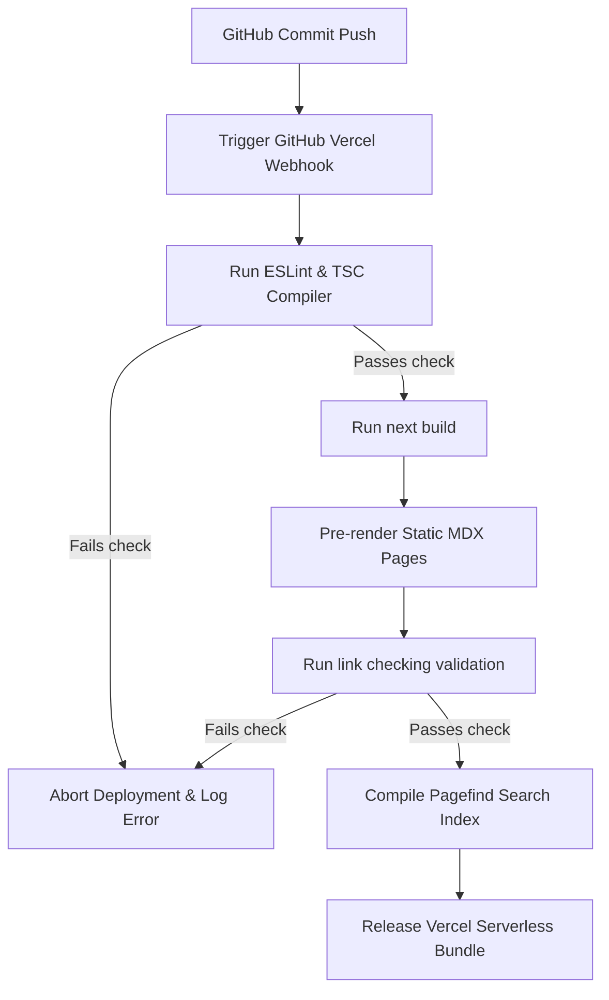

import { Cards, Callout } from 'nextra/components'

# Deployment Specifications

This page outlines the continuous integration, continuous deployment (CI/CD) pipelines, branch release strategies, environment variables, and Vercel hosting rules.

---

## Overview

The Kinetic Platform uses **Vercel** as its serverless hosting provider, integrated directly with GitHub. Pushes to the repository trigger automated pipelines that run TypeScript compilations, ESLint validation, static page pre-rendering, and Nextra Pagefind index generation before deploying the new version.

## Purpose

The purpose of our deployment architecture is to automate delivery controls. This prevents code changes containing compilation errors, broken links, or failing TypeScript types from reaching staging or production systems, ensuring absolute runtime safety.

## Architecture / Flow

The diagram below outlines the automated verification checks executed on repository push events:

---

## Data Flow

Steps mapping deployment releases:
1. **GitHub push event**: An author pushes updates to a branch.
2. **Build trigger**: Vercel retrieves the source code and initializes the build machine.
3. **Environment assembly**: Vercel binds environment credentials (e.g. Supabase connection details).
4. **Bundle optimization**: Vercel executes static optimizations, copies the Pagefind indexes into public endpoints, and maps serverless routes.

---

## Key Components

- `next.config.ts`: Holds Nextra and Next.js webpack parameters.
- `package.json`: Outlines compile scripts (`build`, `start`, `lint`).
- `.vercel/`: Vercel project routing maps.

---

## Database Impact

Deployments run separate database migration procedures using Supabase CLI. Database adjustments should run sequentially before the frontend deployments to prevent route schema conflicts.

---

## Best Practices

<Callout type="warning">
  **Production Release Guard**: Production deployments require a successful build, zero TypeScript lint warnings, and a completed checklist walkthrough on staging environments.
</Callout>

---

## Related Documents

Related Reading:
- **[Getting Started Setup Guide](../getting-started)**: Detailed guidelines to configure environment keys locally.
- **[Architecture Blueprints](../architecture/system-overview)**: Technical specifications of Next.js configurations.
- **[Database schemas tables](../database/schema-overview)**: SQL migrations setups logs checklists.

