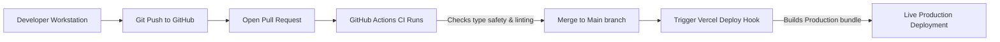

import { Callout } from 'nextra/components'

# Deployment Architecture

Technical documentation for CI/CD pipelines, Vercel hostings, and environment configurations.

---

## Purpose

The main purpose of this module is to ensure system responsiveness, coordinate client events, and maintain relational integrity across data stores.

## Overview

This page provides an overview and technical specifications for the Deployment Architecture subsystem within Base Institute.

## Deployment Pipeline Flow

The platform utilizes a continuous integration and deployment flow:

1. **Local Workstation**: Code is developed and verified locally.
2. **Git Push**: Commits are pushed to the remote repository.
3. **Vercel Deploy**: Code pushes to the `main` branch trigger Vercel to build and deploy the production bundle.

---

## Environment Variables Reference
The platform requires the following environment variables to connect to Supabase services:

| Variable Name | Required | Description |
| :--- | :--- | :--- |
| `NEXT_PUBLIC_SUPABASE_URL` | Yes | The secure endpoint URL of your Supabase project instance. |
| `NEXT_PUBLIC_SUPABASE_ANON_KEY` | Yes | The public anon key, used for client-side API requests. |
| `SUPABASE_SERVICE_ROLE_KEY` | Yes (Server) | Secret service role key, bypassing RLS for administrative operations. |

---

## Next.js Custom Build Options
- **Turbopack Compiler**: Production builds use Turbopack (`next build --turbo`) to optimize asset compilation speeds.
- **TypeScript & ESLint checks**: The build pipeline runs strict linting and type-safety validations to prevent syntax errors from deploying.

> [!CAUTION]
> Keep the `SUPABASE_SERVICE_ROLE_KEY` secret. It must never be exposed on the client-side or committed to public version control repositories.

---

## Architecture

This component is integrated into the Next.js and Supabase tier, responding dynamically to API endpoints and schema constraints.

---

## Best Practices

<Callout type="info">
  **Best Practice**: Ensure that properties and state interfaces remain synchronized with type definitions across the workspace.
</Callout>

---

## Related Links

Related Reading:
- **[System Overview](../../architecture/system-overview)**: Multi-tier architectural blueprints.
- **[Getting Started](../../getting-started)**: Setup guide for local developers.
