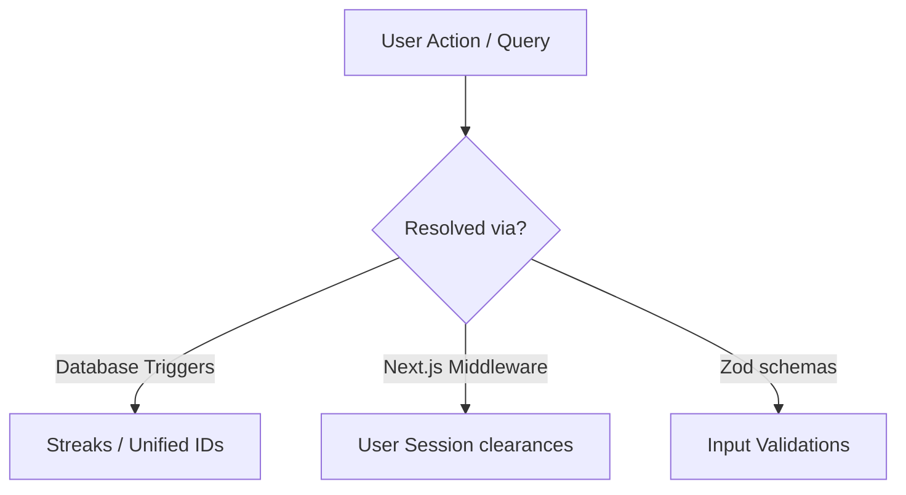
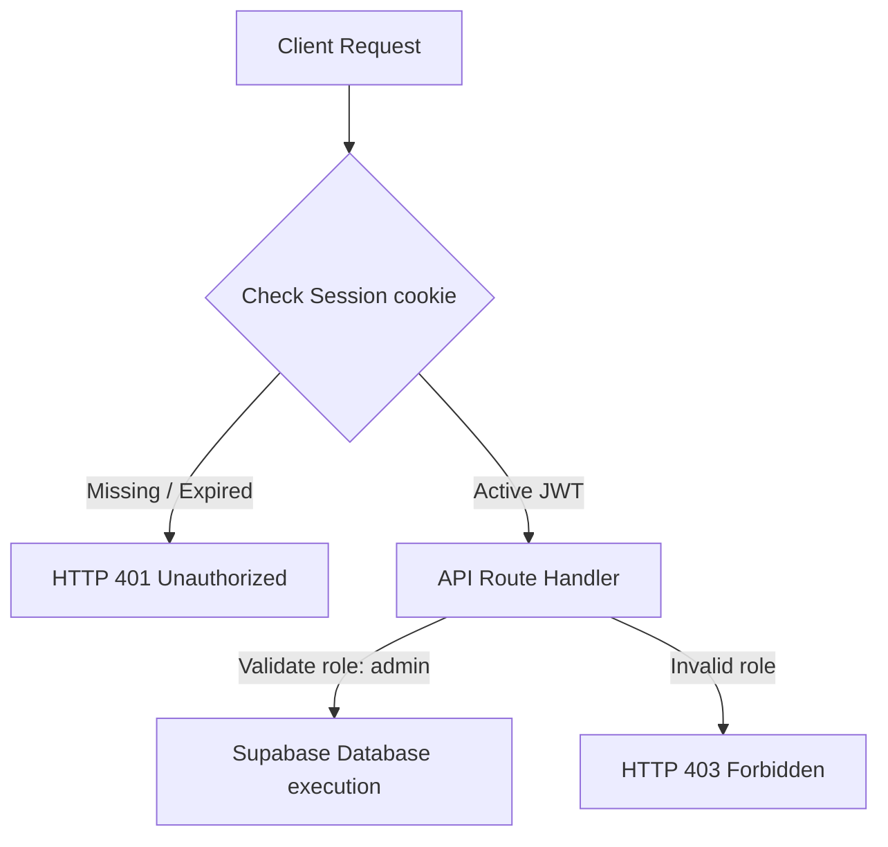

import { Callout } from 'nextra/components'

# Frequently Asked Questions (FAQ)

Answers to common questions regarding local configuration, user authorization, questions management, and the gamified streaks ledger.

---

## Overview

This FAQ guide compiles standard questions and troubleshooting topics regarding developer setups, admin permission hierarchies, database triggers logic, and student progress flows in the Kinetic Platform.

## Purpose

The purpose of this guide is to provide developers, content creators, and administrators with quick answers to operational questions, avoiding redundant research and codebase investigation.

## Architecture / Flow

Common platform behaviors are managed via Next.js serverless route handlers and Supabase PostgreSQL triggers:

## Data Flow

The flow below displays the credential-checking process when an administrative query hits the server:

## Key Components

Below are the most frequently asked questions categorized by operational area:

### 1. Development

#### Q: How do I run the local development server?
A: You can run `npm run dev` to start the local Next.js development server at `http://localhost:3000`. Make sure you have created a `.env.local` containing the staging database connection strings and keys.

#### Q: How does local hot-reloading work with Nextra?
A: Nextra registers a customized Webpack plugin that watches for updates in your `.mdx` files and compiles them to React on the fly, rendering changes in your browser without requiring a server reboot.

### 2. Deployment

#### Q: What steps are run in the CI/CD pipeline before deploying to production?
A: The pipeline executes:
1. Lint checks (`npm run lint`) to ensure codebase consistency.
2. TypeScript compilation (`npx tsc --noEmit`) to verify typed interfaces.
3. Next.js production building (`npm run build`) to pre-compile layout trees and routes.
4. Search indexing (`npx pagefind`) to compile client side indices.

#### Q: Why is my build failing on Vercel but compiling locally?
A: Check that environment variables on Vercel match your local `.env.local`. Also, case-sensitivity in file imports (e.g. `import Comp from './comp'` vs `./Comp`) can fail on Linux builds but succeed on case-insensitive MacOS/Windows filesystems.

### 3. Database

#### Q: How is the visual unified alphanumeric key compiled?
A: The database runs a trigger `trigger_generate_questions_unified_id` which triggers on insertion. It converts the domain name and chronological index using Crockford Base32 formatting to build a human-readable visual key.

#### Q: How does RLS (Row Level Security) affect query execution?
A: RLS policy layers intercept all database transactions. For instance, when a student queries questions, the database automatically filters out records whose status is not set to `Published`, preventing exposure of draft questions.

### 4. Authentication

#### Q: What authentication mechanism is implemented?
A: The system uses Google OAuth and credentials authentication handled by Supabase Auth, wrapping user tokens in secure, HTTP-only session cookies.

#### Q: How are unauthorized users prevented from accessing dashboard pages?
A: A Next.js middleware file (`src/middleware.ts`) intercepts route patterns (like `/student` or `/admin`) and decrypts session cookies. If token credentials are missing or do not contain appropriate permissions, users are redirected back to `/login`.

### 5. Content Creation

#### Q: What are the lifecycle states of questions?
A: A question transitions through four major states:
1. `Draft`: Visible only to the content creator.
2. `InReview`: Assigned to editors for quality checks.
3. `Approved`: Cleared for publication but not yet live.
4. `Published`: Alphanumeric ID generated, active, and live in the student curriculum.

#### Q: What formatting style is used for mathematical formulas?
A: Math formulas must be formatted in LaTeX using standard dollar delimiters. Ensure all operators are wrapped or escaped properly to prevent MDX parser break errors.

### 6. Performance

#### Q: How does Pagefind enable search in static documents?
A: Pagefind reads compiled HTML output files and builds a compressed index block under `public/_pagefind`. In the browser, Pagefind runs client-side WASM queries to locate relevant matches instantly, bypassing server database lookups.

#### Q: Why are large tables or charts paginated?
A: Paginated routes reduce payloads size and DOM nodes complexity, guaranteeing rapid response times on mobile devices or slow networks.

---

## Database Impact

Changes in schema require running SQL migrations on Supabase. Mismatches in database environment configs will lead to queries failing with database connection exceptions.

---

## Best Practices

<Callout type="warning">
  **Security Policy**: Never bypass user role validation check on write operations. Keep queries scoped using authenticated clients.
</Callout>

<Callout type="info">
  **Note**: When editing LaTeX equations, preview them in the Live Preview console first to ensure math syntax parses correctly before submission.
</Callout>

---

## Related Documents

Related Reading:
- **[System Overview](../architecture/system-overview)**: Overall multi-tier platform specs.
- **[Getting Started](../getting-started)**: Setup guide for local developers.
- **[Question Management](../architecture/question-management)**: Editorial workflows guidelines.
- **[Troubleshooting Guide](../troubleshooting)**: Diagnosing build and connection errors.
