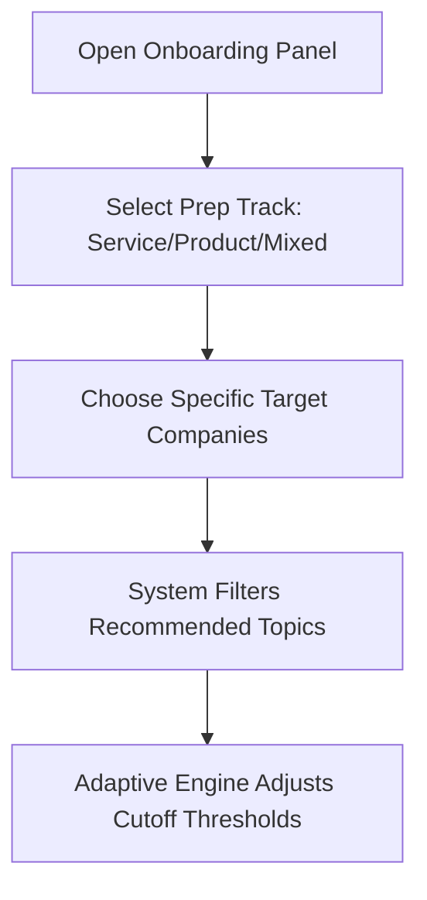

import { Callout } from 'nextra/components'

# Choosing Goals

Learn how to select target companies, configure prep paths, map cutoff benchmarks, and establish learning goals.

---

  

    Reading Time
    3 min read
  

  

    Difficulty
    Beginner
  

  

    Topic
    Setup
  

  

    Last Updated
    Jun 2026
  

---

### What You'll Learn

After reading this guide, you will understand:
✓ How target goals filter recommended questions  
✓ Company-specific selection parameters  
✓ Setting daily solve milestones  
✓ Adjusting preparation levels as placement schedules approach  

---

## Why Goals Matter

Preparation without focus is inefficient. Different companies test different aptitude skills:
- A bank might focus entirely on complex Quantitative data tables.
- A technology consulting firm (like TCS) seeks balanced basic Quantitative and logical sequencing.
- A software developer role demands deep algorithmic logic and coding.

Setting your **Placement Goal** filters the recommendation engine to prioritize questions matching your target company's historical datasets.

---

## How to Set Your Target Goal

### 1. Goal Classification
- **Service Prep Track (TCS, Infosys, Wipro)**: Focused on speed, series recognition, and basic percentages.
- **Product Prep Track (Amazon, Goldman Sachs)**: Focuses on advanced probability, logical matrices, and data structures.
- **Mixed Track**: Broad foundation covering all domains.

### 2. Daily Milestones
Set a realistic daily problem count:
* **Casual Mode**: 5 questions / day (Great for early foundations).
* **Focused Mode**: 10 questions / day (Recommended for steady progress).
* **Clutch Mode**: 20 questions / day (Essential in the final 30 days before placements).

---

## Goal Target Criteria

| Goal Level | Core Target Companies | Difficulty Tier | Recommended Daily Target | Focus Metrics |
| :--- | :--- | :--- | :--- | :--- |
| **Service Tier** | TCS NQT, Wipro Elite, Infosys | Medium | 10 solved questions | Solve speed, consistency |
| **Differential Tier** | TCS Digital, Cognizant GenC | Medium-Hard | 15 solved questions | Advanced math formulas |
| **Product Tier** | Amazon, Microsoft, Startups | Hard | 20 solved questions | High logic complexity, coding |

---

## Example Scenario

> **Vaishnavi's Goal Mapping**  
> Vaishnavi is targeting TCS Digital. She logs into onboarding, selects the **Differential Tier** as her prep path, and adds TCS as her target recruiter. 
> - The platform filters her Concept Hub to highlight advanced number systems and data sufficiency items.
> - Her daily target is set to 15 solves.
> - The recommendation engine flags high-priority practice tasks tagged with `TCS Digital` for her revision sheets.

---

<Callout type="info">
  **Best Practice**: Re-evaluate your goals every month. If you are comfortable hitting 85% accuracy on Service Tier questions, upgrade your prep track to the Product Tech level to challenge yourself.
</Callout>

---

## Related Guides

* **[Welcome to the Academy](../getting-started/welcome)**
* **[How Placement Prep Works](../getting-started/how-prep-works)**
* **[Creating Your Profile](../getting-started/creating-profile)**
