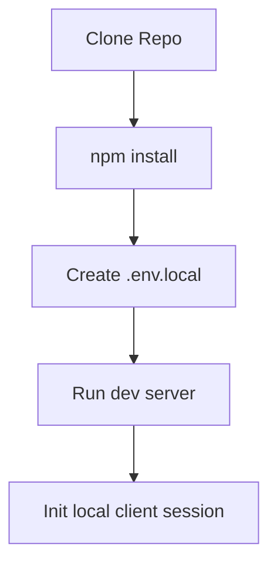

import { Cards, Steps, Callout } from 'nextra/components'

<div className="relative overflow-hidden rounded-[20px] border border-slate-200/50 dark:border-slate-800 bg-linear-to-br from-slate-50 to-blue-50/30 dark:from-slate-950 dark:to-slate-900/40 p-8 mb-8 mt-2">
  <div className="absolute top-0 right-0 w-60 h-60 bg-blue-500/5 rounded-full blur-3xl pointer-events-none" />
  <div className="relative z-10 flex flex-col gap-3">
    <div className="text-[10px] font-black text-blue-600 dark:text-blue-400 uppercase tracking-widest">
      Setup Dashboard
    </div>
    <h1 className="text-2xl font-black tracking-tight text-slate-900 dark:text-white my-0 leading-tight">
      Getting Started
    </h1>
    <p className="text-xs text-slate-500 dark:text-slate-400 leading-relaxed my-0 max-w-xl">
      Configure your system dependencies, clone the workspace, establish your database environment keys, and run your developer sandbox.
    </p>
  </div>
</div>

---

## Overview

Welcome to the Getting Started guide for the Kinetic Platform. This guide is designed to help developer teams, designers, and administrators set up a local testing environment, clone the source code, download required software packages, and configure connectivity to the database services.

## Purpose

The main goal of this guide is to achieve a functioning local developer sandbox environment in under 5 minutes. This ensures that any team member can verify local compilation, execute test suites, and preview UI layouts natively before committing code updates.

## Architecture

Our local configuration maps local environment instances to Supabase Auth services and a local or staging PostgreSQL database cluster:

<div className="grid grid-cols-2 lg:grid-cols-4 gap-4 my-6">
  <div className="p-4 rounded-xl border border-slate-200/60 dark:border-slate-800 bg-white/40 dark:bg-slate-950/20 text-center">
    <span className="text-xl font-black text-slate-800 dark:text-slate-200">18.x+</span>
    <span className="text-[9px] font-extrabold text-slate-400 dark:text-slate-500 tracking-wider uppercase block mt-1">Node Engine</span>
  </div>
  <div className="p-4 rounded-xl border border-slate-200/60 dark:border-slate-800 bg-white/40 dark:bg-slate-950/20 text-center">
    <span className="text-xl font-black text-slate-800 dark:text-slate-200">Next.js 16</span>
    <span className="text-[9px] font-extrabold text-slate-400 dark:text-slate-500 tracking-wider uppercase block mt-1">Framework</span>
  </div>
  <div className="p-4 rounded-xl border border-slate-200/60 dark:border-slate-800 bg-white/40 dark:bg-slate-950/20 text-center">
    <span className="text-xl font-black text-slate-800 dark:text-slate-200">React 19</span>
    <span className="text-[9px] font-extrabold text-slate-400 dark:text-slate-500 tracking-wider uppercase block mt-1">Core UI Library</span>
  </div>
  <div className="p-4 rounded-xl border border-slate-200/60 dark:border-slate-800 bg-white/40 dark:bg-slate-950/20 text-center">
    <span className="text-xl font-black text-slate-800 dark:text-slate-200">~5 Min</span>
    <span className="text-[9px] font-extrabold text-slate-400 dark:text-slate-500 tracking-wider uppercase block mt-1">Est. Setup Time</span>
  </div>
</div>

## Data Flow

The diagram below tracks the sequence for initializing the client environment and fetching environment values:



## Components

Explore setup tutorials and core deployment configurations:

<Cards>
  <Cards.Card icon="👋" title="Introduction Overview" href="../introduction" />
  <Cards.Card icon="📐" title="Architecture blueprints" href="../architecture" />
  <Cards.Card icon="☁️" title="Deployment Pipeline" href="../deployment" />
</Cards>

## Implementation Notes

To initialize the application locally, follow these steps sequentially:

<Steps>
  
  ### Clone Source Workspace
  
  Clone the GitHub repository to copy the platform codebase:
  ```bash
  git clone https://github.com/vaishrap1508/base_institute.git
  cd base_institute
  ```

  ### Download Project Packages
  
  Install dependencies using npm:
  ```bash
  npm install
  ```

  ### Configure Database Environment Keys
  
  Copy `.env.example` into a new `.env.local` file and update your variables:
  ```bash
  cp .env.example .env.local
  ```
  Provide Supabase endpoints and verification keys:
  ```env
  NEXT_PUBLIC_SUPABASE_URL=your-supabase-url
  NEXT_PUBLIC_SUPABASE_ANON_KEY=your-supabase-anon-key
  ```

  ### Start Development Environment
  
  Boot the local hot-reloading Next.js dev server:
  ```bash
  npm run dev
  ```
  Open `http://localhost:3000` in your browser to inspect the application.

</Steps>

## Best Practices

<Callout type="warning">
  **Warning**: Always add `.env.local` to `.gitignore`. Never commit credentials, passwords, or Supabase private keys to the repository.
</Callout>

<Callout type="info">
  **Note**: Run `npm run build` locally before making a pull request. This verifies TypeScript types and lints the code, preventing broken builds in CI/CD.
</Callout>

## Related Links

Related Reading:
- **[Architecture Blueprints](../architecture)**: Overall system tiers and session verification middleware.
- **[Database Schema Overview](../database)**: Schema layout of the `profiles`, `progress`, and `questions` tables.
- **[Deployment Specifications](../deployment)**: Configuring build pipelines and production environments.
