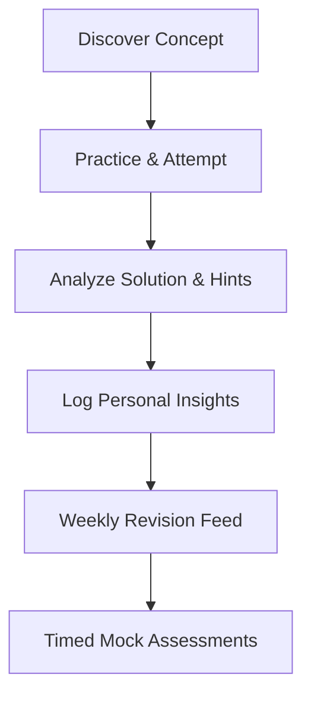

import { Callout, Cards } from 'nextra/components'

# Welcome to the Academy

Learn how to navigate the academy, prepare for high-stakes interviews, and maximize your learning momentum.

---

  

    Reading Time
    3 min read
  

  

    Difficulty
    Beginner
  

  

    Level
    Foundation
  

  

    Last Updated
    Jun 2026
  

---

### What You'll Learn

After reading this guide, you will understand:
✓ The primary objectives of the Placement Academy  
✓ How to utilize adaptive learning pathways  
✓ Core preparation principles for target companies  
✓ Best practices for solving and revising concepts  

---

## Why the Academy Exists

Aptitude solving is often taught as a passive reading process—memorizing formulas from textbook directories. **AptiMaster Academy** changes this dynamic.

We believe in **active-recall solving**:
1. **Learn** the concept through visual, structural explanations.
2. **Apply** it immediately in a split-pane practice arena.
3. **Capture** custom math shortcuts directly in your notebook database.
4. **Revise** systematically based on priority queues, never forgetting the shortcuts you discovered.

Our mission is to help you build long-term retention tools that ensure you pass company qualifying exams with maximum speed and accuracy.

---

## The Student Workflow

Every candidate preparing for placements should follow the core study cycle:

---

## Workflow Feature Guide

| Stage | Purpose | Input Required | Primary Output |
| :--- | :--- | :--- | :--- |
| **Concept Study** | Core understanding of formulas | Visual lectures / examples | Skill Mastery indices |
| **Active Practice** | Build problem speed & correct error pathways | 60s independent solve attempt | Feedback correctness ratios |
| **Quick Save** | Preserve insights inside the solving tab | Folder category + Note entry | Stored Revision asset |
| **Revision Cycle** | Re-solving difficult topics regularly | Pinned High Priority queue | Retention improvements |

---

## Example Student Journey

> **TCS NQT Preparation Journey**  
> Marcus is preparing for the TCS NQT national qualifiers. He struggles with **Logical seating arrangements**.
> - **Week 1**: He reads the Concept Hub, identifies linear arrangement vectors, and attempts 15 medium questions.
> - **Week 2**: He bookmarks 4 seating questions, labeling them as `📂 TCS NQT Prep` with `🔴 High Priority`.
> - **Week 3**: Instead of re-learning from scratch, he filters the Revision Library for TCS NQT, reads his custom seating diagrams, and achieves 100% correctness on the review set.

---

<Callout type="info">
  **Best Practice**: Start early! Daily consistency is the single highest predictor of placement success. Focus on maintaining your streak metrics to build muscle memory.
</Callout>

---

## Related Guides

Continue your placement academy onboarding:
* **[How Placement Prep Works](../getting-started/how-prep-works)**
* **[Creating Your Profile](../getting-started/creating-profile)**
* **[Choosing Goals](../getting-started/choosing-goals)**
