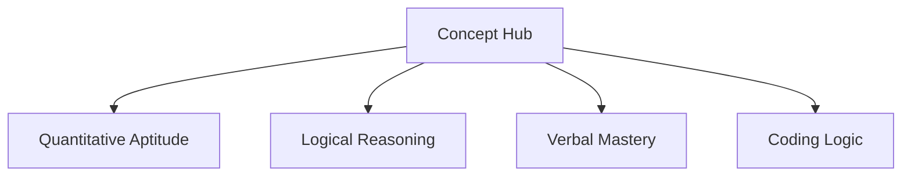

import { Callout } from 'nextra/components'

# Concept Hub

Learn how to navigate the core curriculum domains, browse formulas, and choose subtopics for systematic preparation.

---

<div className="grid grid-cols-2 md:grid-cols-4 gap-4 my-6 p-4 rounded-2xl border border-slate-205 dark:border-slate-800 bg-slate-50/50 dark:bg-slate-900/20">
  <div className="text-center">
    <span className="text-[10px] font-bold text-slate-400 dark:text-slate-500 uppercase tracking-widest block">Reading Time</span>
    <span className="text-sm font-black text-slate-800 dark:text-white mt-1 block">3 min read</span>
  </div>
  <div className="text-center border-l border-slate-200 dark:border-slate-800">
    <span className="text-[10px] font-bold text-slate-400 dark:text-slate-500 uppercase tracking-widest block">Difficulty</span>
    <span className="text-sm font-black text-slate-800 dark:text-white mt-1 block">Beginner</span>
  </div>
  <div className="text-center border-l border-slate-200 dark:border-slate-800">
    <span className="text-[10px] font-bold text-slate-400 dark:text-slate-500 uppercase tracking-widest block">Subject</span>
    <span className="text-sm font-black text-slate-800 dark:text-white mt-1 block">Curriculum</span>
  </div>
  <div className="text-center border-l border-slate-200 dark:border-slate-800">
    <span className="text-[10px] font-bold text-slate-400 dark:text-slate-500 uppercase tracking-widest block">Last Updated</span>
    <span className="text-sm font-black text-slate-800 dark:text-white mt-1 block">Jun 2026</span>
  </div>
</div>

---

### What You'll Learn

After reading this guide, you will understand:
✓ How the curriculum is divided into four main domains  
✓ Moving from basic subtopics to certification milestones  
✓ Accessing visual concept sheets before practice  
✓ Prerequisite structures for advanced formulas  

---

## What is the Concept Hub?

The **Concept Hub** is your central portal for structured subject study. Instead of presenting a random list of questions, it organizes placement aptitude into four core **Curriculum Domains**.



---

## Anatomy of the Curriculum Domains

### 1. Quantitative Aptitude
- **Subtopics**: Percentages, Ratios & Proportions, Profit & Loss, Simple/Compound Interest, Time & Work, Speed & Distance, Geometry.
- **Focus**: Algorithmic shorthand and numerical speed.

### 2. Logical Reasoning
- **Subtopics**: Series & Analogies, Seating Arrangements (Linear/Circular), Syllogisms, Blood Relations, Clocks & Calendars, Cipher Shifting.
- **Focus**: Coordinate spacing, structural reasoning, and pattern recognition.

### 3. Verbal Mastery
- **Subtopics**: Spotting Grammar Errors, Sentence Improvement, Reading Comprehension, Synonyms & Antonyms.
- **Focus**: Context semantics and syntactic accuracy.

### 4. Coding Logic
- **Subtopics**: Variables & Flow, Functions & Scopes, Arrays, Recursion, Object-Oriented Principles, Searching & Sorting, Linked Lists.
- **Focus**: Computational complexities and programmatic debugging.

---

## Student Study Workflow

To learn a new subtopic effectively, use this sequence:

```
[ View Concept Sheet ]
        ↓
[ Read Core Formulas ] (KaTeX render)
        ↓
[ Watch Concept Walkthrough ] (Short introduction)
        ↓
[ Launch Topic Practice ]
```

---

## Concept Hub Best Practices

<Callout type="info">
  **Best Practice: Master Prerequisites First**  
  Do not jump directly into Compound Interest without mastering Percentages first. Compound Interest calculations are built on successive percentage scaling; understanding the foundation makes interest calculations intuitive.
</Callout>

<Callout type="warning">
  **Warning: Concept Sheet Decay**  
  Review the concept sheet summary page for 5 minutes before solving. Hitting the Practice Arena cold without reviewing core equations increases error pathways.
</Callout>

---

## Related Guides

* **[Learning Paths](../learning-system/learning-paths)**
* **[Topic Navigation](../learning-system/topic-navigation)**
* **[Smart Recommendations](../learning-system/smart-recommendations)**
