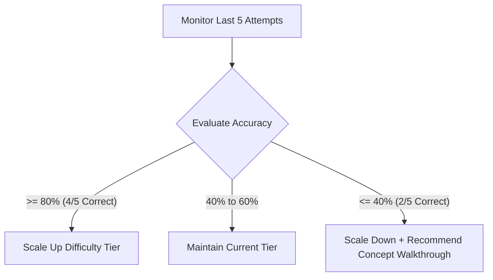

import { Callout } from 'nextra/components'

# Smart Recommendations

Learn how the adaptive recommendation engine evaluates your solve metrics and guides your learning pathway.

---

### What You'll Learn

After reading this guide, you will understand:
✓ How the recommendation engine monitors your attempts  
✓ Scaling logic for automatically adjusting difficulty  
✓ Identifying weakness gaps in your readiness radar  
✓ Acting on AI-generated recommended items  

---

## The Adaptive Engine Logic

The **Smart Recommendation Engine** acts as an automated tutor. Instead of serving questions at random, it analyzes your active competency window to keep you challenged without causing frustration.

---

## Engine Calculations

### 1. Competency Window
- **Definition**: The last 5 consecutive question attempts logged on the platform in a specific subtopic.
- **Metric**: Evaluates accuracy percentage and solve times relative to the concept benchmarks.

### 2. Scaling Rules
- **Promotion Threshold (`>= 80%`)**: The engine increases the difficulty of the next question delivery (e.g. from Medium to Hard).
- **Remediation Threshold (`<= 40%`)**: The engine decreases difficulty (e.g. from Medium to Easy) and displays a recommendation banner prompting you to review the concept notes.
- **Solving Speed Modifier**: If accuracy is high, but solve speed is slow, the engine serves questions at the current difficulty tier but maps similar shortcuts.

---

## Targeted Weakness Remediation

When your Placement Readiness Radar drops in a specific dimension (e.g. Verbal Mastery is 58%):
- The recommendation engine injects high-priority review items into your **Today's Revision** feed.
- It highlights relevant basic concept sheets in the dashboard landing hub.
- It prioritizes these topics in mock test analytics reviews.

---

## Best Practices for Adaptive Practice

<Callout type="info">
  **Best Practice: Do Not Reset Difficulty manually**  
  Let the engine manage your difficulty level. If you struggle with hard questions, focus on logging note insights, and allow the system to guide you back to medium-tier questions until your foundation stabilizes.
</Callout>

<Callout type="warning">
  **Warning: Guessing Penalty**  
  Guessing answers quickly to pass questions degrades the accuracy metric of your competency window, triggering remediation cycles. Read clues carefully and attempt each item for at least 60 seconds.
</Callout>

---

## Related Guides

* **[Concept Hub](../learning-system/concept-hub)**
* **[Learning Paths](../learning-system/learning-paths)**
* **[Topic Navigation](../learning-system/topic-navigation)**
