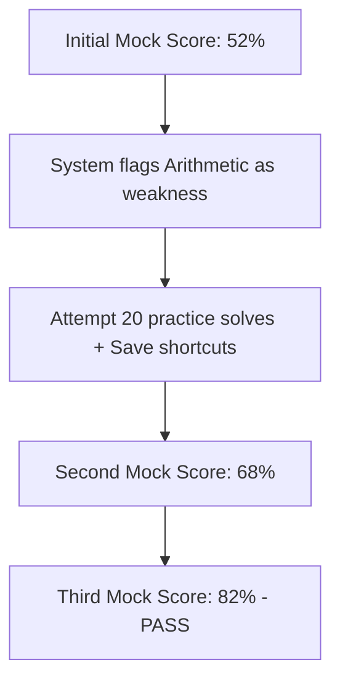

import { Callout } from 'nextra/components'

# Performance Reports

Learn how to interpret comprehensive mock test reports, analyze percentile shifts, and structure target study plans.

---

### What You'll Learn

After reading this guide, you will understand:
✓ Navigating the historical performance listings  
✓ Interpreting percentile rankings relative to other candidates  
✓ Pinpointing specific concept weaknesses from wrong responses  
✓ Syncing performance outcomes back to the adaptive engine  

---

## Why Performance Reports Exist

Your scorecard details *how you did today*. A **Performance Report** tracks *how you are progressing over time*:
- **Historical Trends**: Shows if your speed is improving across tests.
- **Competency Heatmaps**: Highlights subtopics where your accuracy drops consistently.
- **Percentile Ranking**: Compares your performance against peer candidates to show your placement readiness.

---

## Anatomical Progression of Performance

### 1. Weakness Mapping
The report maps your incorrect choices to specific curriculum nodes (e.g. `Quant ➔ Arithmetic ➔ Ratios ➔ Inverse Speeds`).

### 2. Pacing Analysis
Displays solving times per question category to show if you are spending too long on quantitative questions at the expense of verbal questions.

---

## Interpretation Guidelines

- **Percentile >= 90th**: Highly competitive. You meet the benchmarks for product and top-tier service roles.
- **Percentile 70th to 90th**: Good progress. Passable for service roles, but require minor speed improvements.
- **Percentile `<= 70th`**: Concept gaps exist. Focus on the Concept Hub before taking further mock assessments.

---

## Performance Reports Best Practices

<Callout type="info">
  **Best Practice: Review the concept error log**  
  Click on **View Error Log** inside the performance report. It lists the exact question stems you missed. Solve them in the Practice Arena with the **Written Solution** tab open to learn the logic patterns.
</Callout>

<Callout type="warning">
  **Warning: Stale Performance Data**  
  Mock tests taken more than 30 days ago do not reflect your current preparation level. Retake a mock test every 10 days to keep your readiness index updated.
</Callout>

---

## Related Guides

* **[Taking a Mock Test](../mock-tests/taking-mock-test)**
* **[Test Analytics](../mock-tests/test-analytics)**
* **[Time Management](../mock-tests/time-management)**
