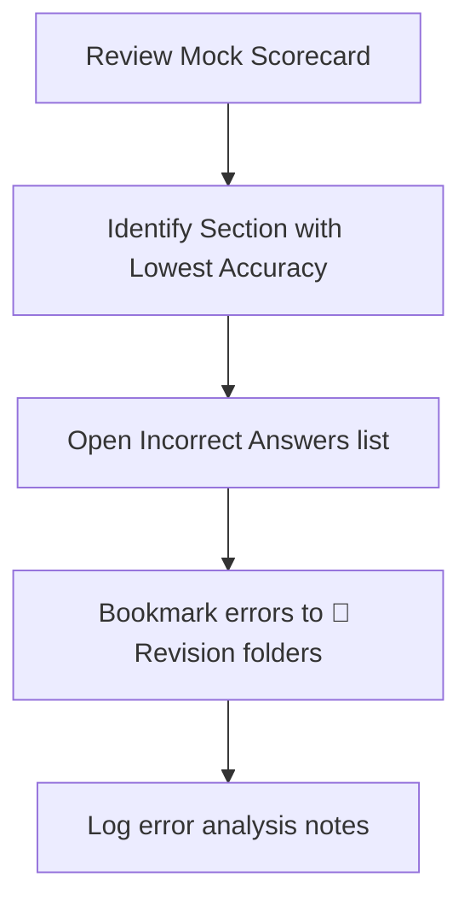

import { Callout } from 'nextra/components'

# Test Analytics

Learn how to read mock test scorecards, evaluate section accuracy, audit solve times, and identify weakness margins.

---

### What You'll Learn

After reading this guide, you will understand:
✓ Evaluating your overall score against placement cutoffs  
✓ Analyzing section-wise correctness ratios  
✓ Mapping average solve speeds to specific subtopics  
✓ Tracking performance shifts across multiple test attempts  

---

## Anatomy of the Test Scorecard

Upon completing a mock test, the platform displays a detailed visual report:

```
+-------------------------------------------------------------+
| [Overall Score: 78%]   [Percentile: 91.2%]  [Status: PASS]  |
+-------------------------------------------------------------+
| [Section Breakdown]                                         |
| Quant: 84% accuracy   | Logical: 68% accuracy  | Verbal: 82% |
+-------------------------------------------------------------+
| [Time Distribution Chart]                                   |
| Average time per correct: 62s   | Average per incorrect: 88s |
+-------------------------------------------------------------+
```

### 1. Overall Cutoff Status
- **PASS**: Meets the historical qualifying benchmark for the target recruiter.
- **BORDERLINE**: Within 5% of the qualifying line. Remediation advised.
- **FAIL**: Below the cutoff threshold. Recommended to review foundational paths.

### 2. Time-Accuracy Matrix
Tracks whether errors were caused by **speed pressure** (high error rates in the final 5 minutes) or **conceptual gaps** (high error rates on specific subtopics regardless of time remaining).

---

## Test Review and Remediation Workflow



---

## Test Analytics Best Practices

<Callout type="info">
  **Best Practice: Review incorrect answers first**  
  Do not just look at your final score. Open the incorrect answers feed and click the **Video Solution** tab for each mistake. Understanding the exact point of failure is crucial for improvement.
</Callout>

<Callout type="warning">
  **Warning: Time Trap Detection**  
  Look for questions where you spent more than 150 seconds and still got the answer wrong. These are your **Time Traps**. In future exams, skip these items immediately.
</Callout>

---

## Related Guides

* **[Taking a Mock Test](../mock-tests/taking-mock-test)**
* **[Time Management](../mock-tests/time-management)**
* **[Performance Reports](../mock-tests/performance-reports)**
