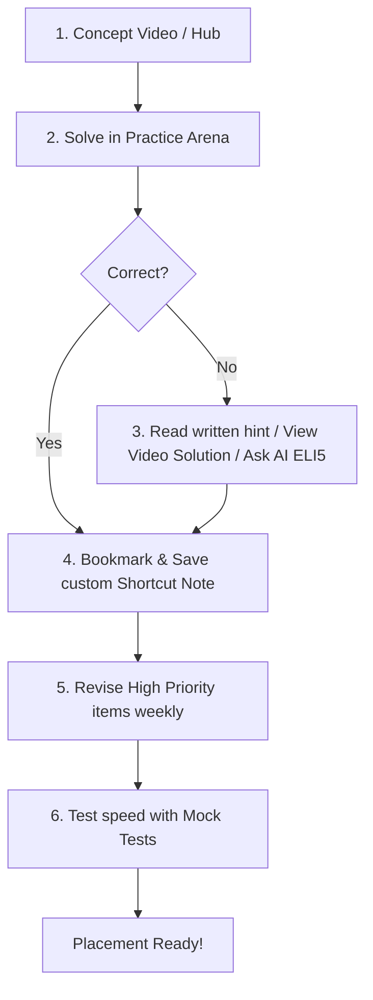

import { Cards, Callout } from 'nextra/components'

# AptiMaster Placement Academy

Welcome to the official **AptiMaster Placement Academy Knowledge Base**. This is a comprehensive learning and revision workspace designed to prepare you for technical and aptitude interviews at top-tier companies.

---

  

  

  

    

      Student Prep Guide
    

    <h1 className="text-3xl md:text-5xl font-black tracking-tight text-slate-900 dark:text-white my-0 leading-tight">
      Solve, Learn, Revise
    </h1>
    

      Master quantitative aptitude, logical sequences, verbal mastery, and coding logic in a gamified, self-contained revision environment.
    

    

      <a href="./getting-started/welcome" className="inline-flex items-center gap-2 bg-blue-600 hover:bg-blue-700 dark:bg-blue-500 dark:hover:bg-blue-600 text-white font-semibold text-xs px-6 py-3.5 rounded-xl shadow-xs transition-all hover:translate-y-[-1px] no-underline">
        Get Started
        <svg className="w-3.5 h-3.5" fill="none" viewBox="0 0 24 24" stroke="currentColor"><path strokeLinecap="round" strokeLinejoin="round" strokeWidth={2.5} d="M9 5l7 7-7 7" /></svg>
      </a>
    

  

---

## Academy Structure

Our academy organizes learning and practice into 8 progressive chapters:

  <a href="./getting-started/welcome" className="group relative block p-6 rounded-2xl border border-slate-200 dark:border-slate-800 bg-white/50 dark:bg-slate-900/40 hover:bg-white dark:hover:bg-slate-900 hover:border-blue-500/50 dark:hover:border-blue-400/40 hover:shadow-lg transition-all duration-300 no-underline">
    <h3 className="text-base font-extrabold text-slate-850 dark:text-slate-100 m-0 group-hover:text-blue-600 dark:group-hover:text-blue-400 transition-colors">
      1. Getting Started
    </h3>
    

      Learn how the placement prep cycle works, customize your student profile, and establish targeted preparation goals.
    

  </a>

  <a href="./learning-system/concept-hub" className="group relative block p-6 rounded-2xl border border-slate-200 dark:border-slate-800 bg-white/50 dark:bg-slate-900/40 hover:bg-white dark:hover:bg-slate-900 hover:border-blue-500/50 dark:hover:border-blue-400/40 hover:shadow-lg transition-all duration-300 no-underline">
    <h3 className="text-base font-extrabold text-slate-850 dark:text-slate-100 m-0 group-hover:text-blue-600 dark:group-hover:text-blue-400 transition-colors">
      2. Learning System
    </h3>
    

      Browse the Concept Hub, follow structured Learning Paths, use topic navigation, and get AI-guided recommendations.
    

  </a>

  <a href="./practice-arena/solving-questions" className="group relative block p-6 rounded-2xl border border-slate-200 dark:border-slate-800 bg-white/50 dark:bg-slate-900/40 hover:bg-white dark:hover:bg-slate-900 hover:border-blue-500/50 dark:hover:border-blue-400/40 hover:shadow-lg transition-all duration-300 no-underline">
    <h3 className="text-base font-extrabold text-slate-850 dark:text-slate-100 m-0 group-hover:text-blue-600 dark:group-hover:text-blue-400 transition-colors">
      3. Practice Arena
    </h3>
    

      Solve questions, view video/written explanations, utilize the AI ELI5 helper, and log insights without leaving the solver pane.
    

  </a>

  <a href="./revision-system/revision-library" className="group relative block p-6 rounded-2xl border border-slate-200 dark:border-slate-800 bg-white/50 dark:bg-slate-900/40 hover:bg-white dark:hover:bg-slate-900 hover:border-blue-500/50 dark:hover:border-blue-400/40 hover:shadow-lg transition-all duration-300 no-underline">
    <h3 className="text-base font-extrabold text-slate-850 dark:text-slate-100 m-0 group-hover:text-blue-600 dark:group-hover:text-blue-400 transition-colors">
      4. Revision System
    </h3>
    

      Build and organize customized folders, categorize by revision priority, and review shortcuts with the Revision Library.
    

  </a>

  <a href="./mock-tests/taking-mock-test" className="group relative block p-6 rounded-2xl border border-slate-200 dark:border-slate-800 bg-white/50 dark:bg-slate-900/40 hover:bg-white dark:hover:bg-slate-900 hover:border-blue-500/50 dark:hover:border-blue-400/40 hover:shadow-lg transition-all duration-300 no-underline">
    <h3 className="text-base font-extrabold text-slate-850 dark:text-slate-100 m-0 group-hover:text-blue-600 dark:group-hover:text-blue-400 transition-colors">
      5. Mock Tests
    </h3>
    

      Verify exam readiness using timed mock assessments, detailed test analytics, and target speed logs.
    

  </a>

  <a href="./progress-rankings/streaks" className="group relative block p-6 rounded-2xl border border-slate-200 dark:border-slate-800 bg-white/50 dark:bg-slate-900/40 hover:bg-white dark:hover:bg-slate-900 hover:border-blue-500/50 dark:hover:border-blue-400/40 hover:shadow-lg transition-all duration-300 no-underline">
    <h3 className="text-base font-extrabold text-slate-850 dark:text-slate-100 m-0 group-hover:text-blue-600 dark:group-hover:text-blue-400 transition-colors">
      6. Progress & Rankings
    </h3>
    

      Keep learning streaks alive, accumulate XP, levels, and badges, and gauge your Placement Readiness Index (PRI).
    

  </a>

  <a href="./ai-features/ai-mentor" className="group relative block p-6 rounded-2xl border border-slate-200 dark:border-slate-800 bg-white/50 dark:bg-slate-900/40 hover:bg-white dark:hover:bg-slate-900 hover:border-blue-500/50 dark:hover:border-blue-400/40 hover:shadow-lg transition-all duration-300 no-underline">
    <h3 className="text-base font-extrabold text-slate-850 dark:text-slate-100 m-0 group-hover:text-blue-600 dark:group-hover:text-blue-400 transition-colors">
      7. AI Features
    </h3>
    

      Use the AI Mentor for target insights, trigger simple ELI5 breakdowns, and receive adaptive solution feedback.
    

  </a>

  <a href="./account-settings/profile" className="group relative block p-6 rounded-2xl border border-slate-200 dark:border-slate-800 bg-white/50 dark:bg-slate-900/40 hover:bg-white dark:hover:bg-slate-900 hover:border-blue-500/50 dark:hover:border-blue-400/40 hover:shadow-lg transition-all duration-300 no-underline">
    <h3 className="text-base font-extrabold text-slate-850 dark:text-slate-100 m-0 group-hover:text-blue-600 dark:group-hover:text-blue-400 transition-colors">
      8. Account & Settings
    </h3>
    

      Adjust visibility preferences (Public vs Recruiter), manage notification channels, and export revision databases.
    

  </a>

---

## Guided Student Journey

We recommend adopting this loop to maximize your accuracy and solve times:

<Callout type="info">
  **Best Practice**: Start with **[Getting Started: Welcome](./getting-started/welcome)** to personalize your preparation target, choose your company goals, and customize your placement profile.
</Callout>
