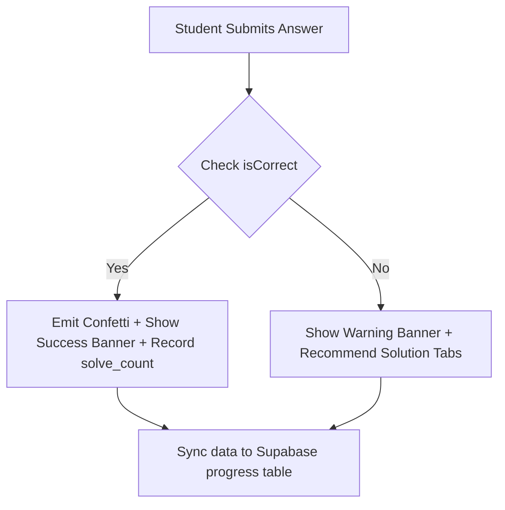

import { Callout } from 'nextra/components'

# Understanding Feedback

Learn how the grading engine evaluates selections, triggers success events, logs correctness telemetry, and reveals solution sheets.

---

  

    Reading Time
    3 min read
  

  

    Difficulty
    Beginner
  

  

    System
    Grading
  

  

    Last Updated
    Jun 2026
  

---

### What You'll Learn

After reading this guide, you will understand:
✓ How choice selection triggers correctness grading  
✓ The anatomy of correct vs incorrect feedback cards  
✓ Visual telemetry logs generated on attempt submission  
✓ Emitter events that drive success confetti effects  

---

## Grading Engine Workflow

When you click "Submit", the platform evaluates your answer choice asynchronously:

### 1. Success States
- **Display**: The option box lights up in solid emerald green.
- **Feedback**: A toast message says `Correct! 🔥`.
- **Celebration**: An absolute canvas-overlay confetti emitter releases multi-colored particle streams.

### 2. Error States
- **Display**: The selected option turns rose red, and the correct option is highlighted in green.
- **Feedback**: A toast message says `Not quite yet. 🎯`.

---

## What Happens Behind the Scenes?

When you submit an attempt, the client compiles metadata and updates local/remote databases:
- **Solve Count**: Increments if correct and not previously answered.
- **Streak Status**: Updates last active timestamp. If the solve occurred within 24–48 hours of the previous activity, the streak counter increases.
- **Telemetry Event**: Logs solve duration, question ID, and option ID to `user_progress` table.

---

## Feedback Best Practices

<Callout type="info">
  **Best Practice: Review the Video Solution immediately after an error**  
  If you get a question wrong, do not click "Next" immediately. Spend 2 minutes reviewing the Written or Video solutions. Consuming the solution while the problem context is fresh in your working memory maximizes retention.
</Callout>

<Callout type="warning">
  **Warning: Security Verification**  
  Correct answer indexes are never sent in the initial question payload. Verification occurs on-submit or via secure routes to prevent inspect-element leaks.
</Callout>

---

## Related Guides

* **[Solving Questions](../practice-arena/solving-questions)**
* **[Using Video Solutions](../practice-arena/using-video-solutions)**
* **[AI ELI5 Assistant](../practice-arena/ai-assistant)**
