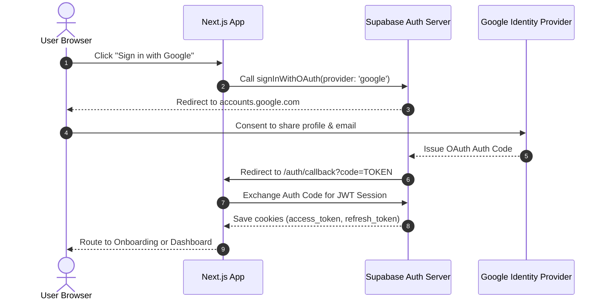

import { Callout } from 'nextra/components'

# Google OAuth Integration

Technical documentation for the third-party Google OAuth integration using Supabase Auth.

---

## Overview

This page provides an overview and technical specifications for the Google OAuth Integration subsystem within the Kinetic Platform.

## Purpose
Google OAuth provides a fast, one-click sign-in option for students, content creators, and administrators. It automates credentials handling, simplifies onboarding, and coordinates roles based on email domains.

---

## Authorization Flow

---

## Technical Configuration
- **Supabase Integration**: Nextra relies on Supabase Auth's native OAuth provider configurations.
- **Client Implementation**: Uses `supabase.auth.signInWithOAuth({ provider: 'google', options: { redirectTo: ... } })`.
- **Redirect Rule**: Redirect URLs are processed through the `/auth/callback` endpoint before the user is routed to the dashboard.

---

## Security Considerations
> [!CAUTION]
> Redirect URLs must be explicitly configured in the Supabase Dashboard to prevent unauthorized redirection exploits.

---

## Architecture

This component is integrated into the Next.js and Supabase tier, responding dynamically to API endpoints and schema constraints.

---

## Best Practices

<Callout type="info">
  **Best Practice**: Ensure that properties and state interfaces remain synchronized with type definitions across the workspace.
</Callout>

---

## Related Links

Related Reading:
- **[System Overview](../../../architecture/system-overview)**: Multi-tier architectural blueprints.
- **[Getting Started](../../../getting-started)**: Setup guide for local developers.
