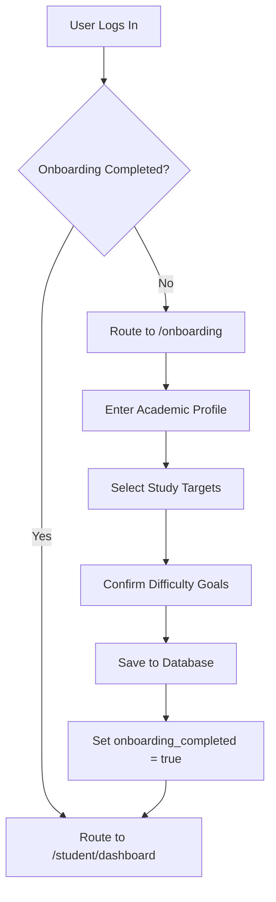

import { Callout } from 'nextra/components'

# Onboarding Questionnaire Flow

Technical documentation for the onboarding questionnaire, route restrictions, and user profile configuration.

---

## Overview

This page provides an overview and technical specifications for the Onboarding Questionnaire Flow subsystem within Base Institute.

## Purpose
The Onboarding flow gathers critical profile settings from new users. It updates names, gathers learning objectives, logs academic fields, and registers initial tracking parameters before loading the student dashboard.

---

## Onboarding Lifecycle

---

## Technical Details & Route Protection
Access control is managed at the Edge network layer inside [middleware.ts](file:///Users/vaishu/Downloads/Base_Project/middleware.ts):
- **Access Check**: Next.js middleware checks if the user is authenticated.
- **Onboarding Redirect**:
  - Regular students must complete the onboarding form before they can access the dashboard.
  - If a student tries to bypass onboarding, the middleware automatically redirects them to `/onboarding`.
  - Testing profiles (e.g. `student@university.edu` or `sriram_neppalli@university.edu`) are exempt and bypass onboarding checks.

---

## Database Schema
The onboarding wizard saves user entries across the following tables:
- **`public.profiles`**: Updates display name, college, branch, and graduation year details.
- **`public.onboarding_profile`**: Stores specialized preferences, such as primary goals, degrees, and the chosen avatar seed.
- **`public.user_streaks`**: Initializes a streak record with a starting value of `0`.

> [!NOTE]
> Saving onboarding details sets the `aptitude_onboarding_completed` cookie to `true` to speed up subsequent middleware checks.

---

## Architecture

This component is integrated into the Next.js and Supabase tier, responding dynamically to API endpoints and schema constraints.

---

## Best Practices

<Callout type="info">
  **Best Practice**: Ensure that properties and state interfaces remain synchronized with type definitions across the workspace.
</Callout>

---

## Related Links

Related Reading:
- **[System Overview](../../../architecture/system-overview)**: Multi-tier architectural blueprints.
- **[Getting Started](../../../getting-started)**: Setup guide for local developers.
