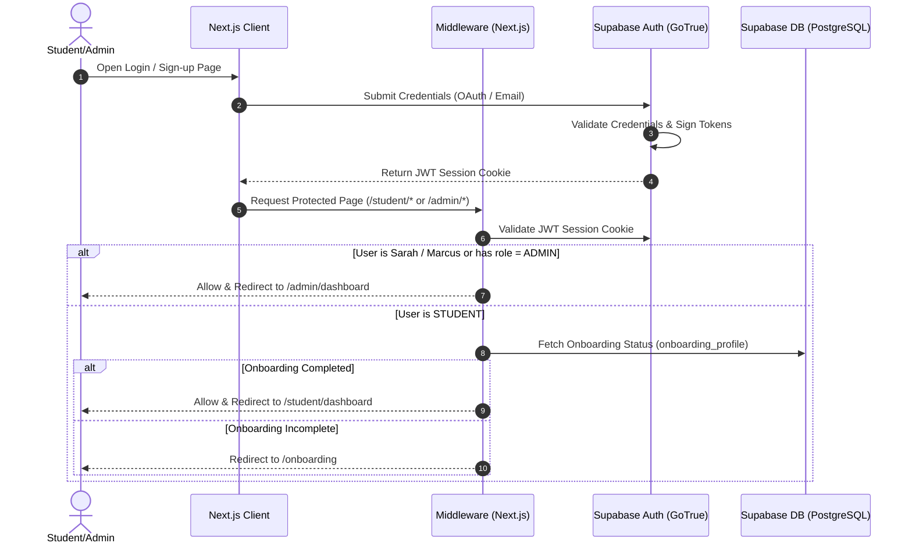

import { Callout } from 'nextra/components'

# Authentication Architecture

A detailed guide to the Kinetic Platform's identity validation, authorization workflows, role management, and session rules.

---


## Purpose

The main purpose of this module is to ensure system responsiveness, coordinate client events, and maintain relational integrity across data stores.

## Overview
The Kinetic Platform uses **Supabase Auth (GoTrue)** to manage account creation and user verification. This authentication flow connects email/password accounts, Google OAuth tokens, and session cookies with Next.js edge middleware.

---

## Authentication Architecture Diagram



---

## Core Authentication Flows

### 1. Google OAuth Flow
- **Initiation**: The student clicks "Sign in with Google", calling the `supabase.auth.signInWithOAuth` client-side API.
- **Verification**: Directs the browser to Google's consent screen. Google redirects back to `/auth/callback` with verification keys.
- **Mapping**: The callback route exchanges keys for a session token, saving cookies before routing the user.

### 2. Email Sign-Up Flow
- **Initiation**: User submits the sign-up form with their email and password.
- **Insertion**: Supabase Auth inserts a row into `auth.users` and dispatches a verification email containing a redirect token.
- **Verification**: The student clicks the email link, directing them to the `/auth/callback` handler to activate the account.

### 3. Email Login Flow
- **Submission**: User enters their email and password.
- **Validation**: Supabase checks the hashed credentials. If correct, it returns session tokens and updates login timestamps.

### 4. Forgot Password Flow
- **Request**: User requests a password reset, dispathing a tokenized link via `/api/auth/forgot-password`.
- **Reset**: Clicking the link redirects the user to `/auth/reset-password`, allowing them to submit a new password safely.

---

## Profile Creation Trigger
To keep tables in sync, a database trigger automatically runs whenever a user signs up:
- **Function**: `public.handle_new_user()` is triggered by insertions into `auth.users`.
- **Behavior**: Automatically creates a matching user record in `public.profiles`, transferring email, display name, and assigning their role.
- **Role Assignment Rule**:
  ```sql
  CASE 
    WHEN new.email = 'sarah.c@aptitude-ai.com' THEN 'ADMIN'::user_role
    ELSE 'STUDENT'::user_role
  END
  ```

---

## User Roles
The platform defines two roles via the `user_role` type:
1. **STUDENT**: Standard learning role, with access restricted to `/student/*` and `/onboarding` paths.
2. **ADMIN**: Administrative role, with access to question verification pipelines, user logs, and stats under `/admin/*`.

---

## Route Protection & Middleware
Access control is managed at the Edge network layer inside [middleware.ts](file:///Users/vaishu/Downloads/Base_Project/middleware.ts):
- **Checks**: Verifies user session tokens on every request.
- **Protected Paths**: Requests targeting `/student/*`, `/admin/*`, or `/onboarding/*` require a valid session.
- **Onboarding Redirect**:
  - Regular students must complete the onboarding form before they can access the dashboard.
  - If a student tries to bypass onboarding, the middleware automatically redirects them to `/onboarding`.
  - Testing profiles (e.g. `student@university.edu` or `sriram_neppalli@university.edu`) are exempt and bypass onboarding checks.

---

## Security Considerations
> [!CAUTION]
> - **Session Security**: Session cookies use `HttpOnly`, `Secure`, and `SameSite=Lax` configurations to prevent cross-site scripting (XSS) token extraction.
> - **Trigger Protection**: The `handle_new_user` function runs using `SECURITY DEFINER` privileges. The search path is explicitly locked to `search_path = public` to prevent privilege escalation exploits.

---

## Architecture

This component is integrated into the Next.js and Supabase tier, responding dynamically to API endpoints and schema constraints.

---

## Best Practices

<Callout type="info">
  **Best Practice**: Ensure that properties and state interfaces remain synchronized with type definitions across the workspace.
</Callout>

---

## Related Links

Related Reading:
- **[System Overview](../../architecture/system-overview)**: Multi-tier architectural blueprints.
- **[Getting Started](../../getting-started)**: Setup guide for local developers.
