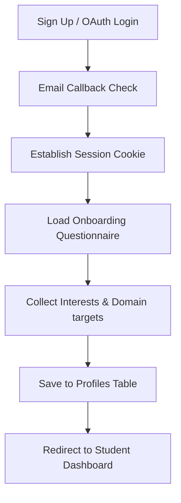

import { Cards, Tabs, Callout } from 'nextra/components'

{/* Hero Banner Header */}

  

  

    

      Product Guides
    

    <h1 className="text-2xl font-black tracking-tight text-slate-900 dark:text-white my-0 leading-tight">
      Product Overview
    </h1>
    

      Understand end-to-end user pathways: from account registration and email confirmation to Google credentials exchange and the onboarding questionnaire.
    

  

---

## Overview

Welcome to the Product Specifications section. This page outlines the core user authentication flows, registration steps, third-party social provider configurations, and the onboarding wizard questionnaire that sets up a student's learning target.

## Purpose

The main purpose of our authentication and onboarding modules is to create a seamless, friction-free entry point for students while securing their profiles databases rows. This ensures accurate cohort statistics, personalized recommendation setups, and secure identity tracking.

## Architecture

Our authentication flow combines local password registers with social identity provider tokens:

  

    2 Screens
    Auth Panels
  

  

    Google OAuth
    Social Provider
  

  

    4 Steps
    Onboarding Flow
  

  

    Yes
    Sandbox Mode
  

## Data Flow

The flow chart below maps the sequential student onboarding path:

## Components

Select a product guide to explore:

<Cards>
  <Cards.Card icon="🔐" title="Authentication Overview" href="./authentication" />
  <Cards.Card icon="✉️" title="Email & Password Auth" href="./authentication/email-auth" />
  <Cards.Card icon="🌐" title="Google OAuth Provider" href="./authentication/google-auth" />
  <Cards.Card icon="📋" title="Onboarding Wizard Questionnaire" href="./authentication/onboarding-flow" />
</Cards>

## Implementation Notes

Our authentication schemes utilize Supabase GoTrue servers:

<Tabs items={['Email Authentication', 'Google OAuth Flow']}>
  
  <Tabs.Tab>
    ### Email & Password Authentication Workflow
    
    1. **Registration**: The student inputs an email, full name, and password on the signup panel.
    2. **Verification Trigger**: Supabase Auth sends an email containing a secure token.
    3. **Session Verification**: When clicked, redirects the user to `/auth/callback` to establish secure session cookies.
    
    <Callout type="info">
      Local sandbox modes bypass verification, immediately redirecting developers to `/onboarding`.
    </Callout>
  </Tabs.Tab>

  <Tabs.Tab>
    ### Google OAuth Integration
    
    1. **Credentials Redirection**: The student selects "Sign in with Google" on the login screen.
    2. **Redirect to Google**: Next.js redirects credentials matching flows to the Google Accounts validation page.
    3. **Identity Registration**: On success, logs user data, updates matching database profiles, and directs the student to dashboard layouts.
  </Tabs.Tab>

</Tabs>

## Best Practices

<Callout type="warning">
  **Warning**: Do not expose tokens in URL path parameters. The `/auth/callback` endpoint must consume query tokens server-side and issue HTTP-only cookies.
</Callout>

<Callout type="info">
  **Note**: Ensure local development runs `.env.local` configured with the correct client client secret keys for Google OAuth services.
</Callout>

## Related Links

Related Reading:
- **[System Overview](../architecture/system-overview)**: Multi-tier architectural blueprints.
- **[Getting Started](../getting-started)**: Setup guide for local developers.
