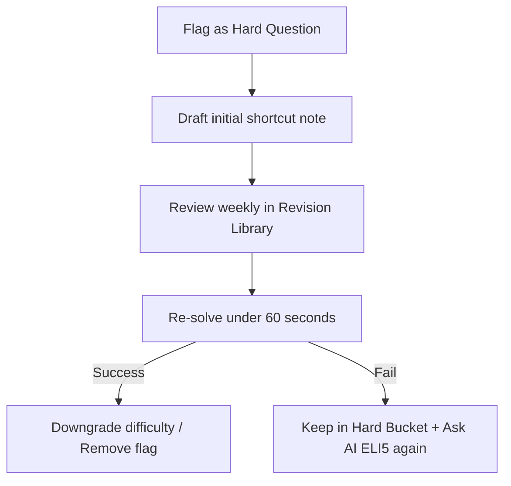

import { Callout } from 'nextra/components'

# Hard Questions

Learn how to identify complex question patterns, flag items for your revision bucket, and structure remedial study.

---

### What You'll Learn

After reading this guide, you will understand:
✓ Flagging questions as "Hard Questions"  
✓ Finding the system "Hard Questions" bucket  
✓ Breaking down complex calculations into steps  
✓ Re-evaluating hard questions after revision  

---

## Why the Hard Questions Bucket Exists

A common mistake in placement prep is solving 100 questions once and never looking back. You learn the most from the questions you got wrong or struggled with.
- **Mark Hard**: In the bottom actions panel, single-click "Mark Hard" to assign a question to the `🔥 Hard Questions` system bucket.
- **Immediate Indexing**: The question is stored in local databases under `aptitude_hard_questions`, updating the revision counts instantly.

---

## The Remediation Cycle

When tackling questions flagged as hard, apply this cycle:

---

## Hard Questions Best Practices

<Callout type="info">
  **Best Practice: Keep notes on why the question was hard**  
  Do not just click the "Hard" flag. Write a single sentence in **Quick Notes** explaining the trick (e.g. *"CP markup discount sequence is applied backwards"*). When you review the bucket, this sentence saves you minutes.
</Callout>

<Callout type="warning">
  **Warning: Empty the Bucket**  
  Keep your hard bucket small (under 30 items). Re-solve items weekly. Once you successfully solve a hard question twice under speed constraints, unflag it to maintain study focus.
</Callout>

---

## Related Guides

* **[Revision Library](../revision-system/revision-library)**
* **[Priority Management](../revision-system/priority-management)**
* **[Note Taking Strategies](../revision-system/note-taking-strategies)**
