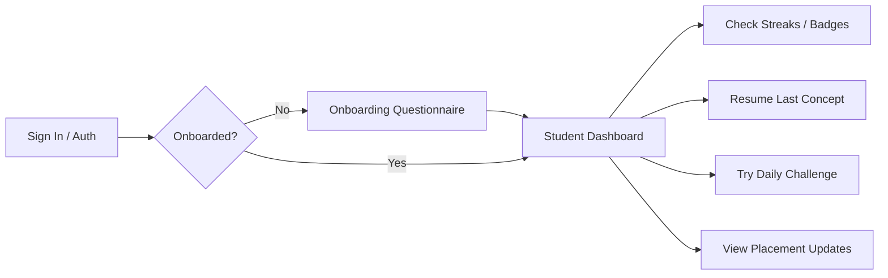

import { Callout } from 'nextra/components'

# Student Dashboard

The primary command center for student learning, streak tracking, goals configuration, and recommended milestones.

---

## Purpose

The main purpose of this module is to ensure system responsiveness, coordinate client events, and maintain relational integrity across data stores.

## Overview & Purpose
The Student Dashboard serves as the central hub for the student learning experience. It is designed to maximize daily engagement and focus by surfacing active progress metrics, gamifying streaks, presenting immediate "Continue Learning" routes, and highlighting upcoming mock tests or job opportunities.

---

## User Journey

---

## Dashboard Architecture
The student interface is implemented as a client-side Single Page Application (SPA) inside [src/app/student/dashboard/page.tsx](file:///Users/vaishu/Downloads/Base_Project/src/app/student/dashboard/page.tsx). It holds states for:
- `activeSidebarTab`: Directs tab switches (`dashboard`, `learning`, `practice`, `mockTests`, `careerHub`, `leaderboards`, `badges`).
- `userStreaks`: Synchronized streak calculations, tracks daily activity timestamps.
- `opportunities` / `announcements`: Fetched on mount, populating the placement updates and career widgets.

---

## Core Components & Features

### 1. Continue Learning Card
- **Logic**: Automatically scans `user_progress` and `progress_tracking` records to determine the most recently modified concept with `status = 'In Progress'`.
- **UI Behavior**: Displays a prominent card at the top of the dashboard containing the concept name, domain title, last-studied timestamp, and a primary **"Resume Module"** action that routes the user directly to the learning page.

### 2. XP & Streak Systems
- **XP (Experience Points)**: Awarded dynamically upon completing quizzes, reading lesson transcripts, or finishing mock exams. Writing progress entries triggers Postgres function cascades that update `profiles.total_xp`.
- **Streak System**: Monitored in the `user_streaks` table. 
  - Tracks the student's `current_streak` and `max_streak`.
  - Upon user login, a function evaluates if `now() - last_activity_at < 24 hours` (relative to Indian Standard Time - IST). If yes, the streak is maintained. If it exceeds 24 but is within 48 hours, it increments. Otherwise, the streak is reset to `0`.

### 3. Subject Learning Tracks
The dashboard lists five primary course tracks, each configured with visual progress rings:
- **Quantitative Aptitude**: Arithmetic, Algebra, Geometry, Mensuration, Probability, and Time/Speed/Distance.
- **Logical Reasoning**: Venn diagrams, series analogies, arrangements, blood relations, clocks, and calendars.
- **Verbal Ability**: Grammatical correction, reading comprehension, synonyms/antonyms, prepositions.
- **Coding & Computer Science**: Big O complexities, array operations, sorting, binary trees, recursion, and object-oriented programming.

### 4. Career Hub Widget
- **Functionality**: A preview card highlighting active job openings, internships, and webinars from the `opportunities` database.
- **Filtering**: Prompts students with tags like `Closing Soon`, `New`, or `Open`. Clicking items redirects to recruiter links or opens full application guidelines.

### 5. Challenge System
- **Roadmap Challenges**: Every concept node incorporates a standard practice quiz.
- **Daily Challenges**: Surfaces questions from the `ROADMAP_CHALLENGES` map (e.g. laptop price drops, recursive Fibonacci complexities).
- **Mastery Milestones**: Integrated milestone questions (e.g., guaranteed O(N log N) sorting algorithms with O(N) space) that award unique certifications upon completion.

---

## Dynamic Data Sources
- **Profiles Database**: `public.profiles` updates display details and total XP.
- **Streaks Log**: `public.user_streaks` monitors daily consecutive log events.
- **Progress Log**: `public.user_progress` compiles question attempts and timestamps.
- **Opportunities Ledger**: `public.opportunities` populates hiring drives.

---

## Future Enhancements
- **AI-Driven Study Recommendations**: Integrating machine-learning endpoints to recommend specific practice sets based on a student's weak areas.
- **Collaborative Group Challenges**: Allowing students to form study cohorts and compete in real-time practice tournaments.

---

## Architecture

This component is integrated into the Next.js and Supabase tier, responding dynamically to API endpoints and schema constraints.

---

## Best Practices

<Callout type="info">
  **Best Practice**: Ensure that properties and state interfaces remain synchronized with type definitions across the workspace.
</Callout>

---

## Related Links

Related Reading:
- **[System Overview](../../architecture/system-overview)**: Multi-tier architectural blueprints.
- **[Getting Started](../../getting-started)**: Setup guide for local developers.
