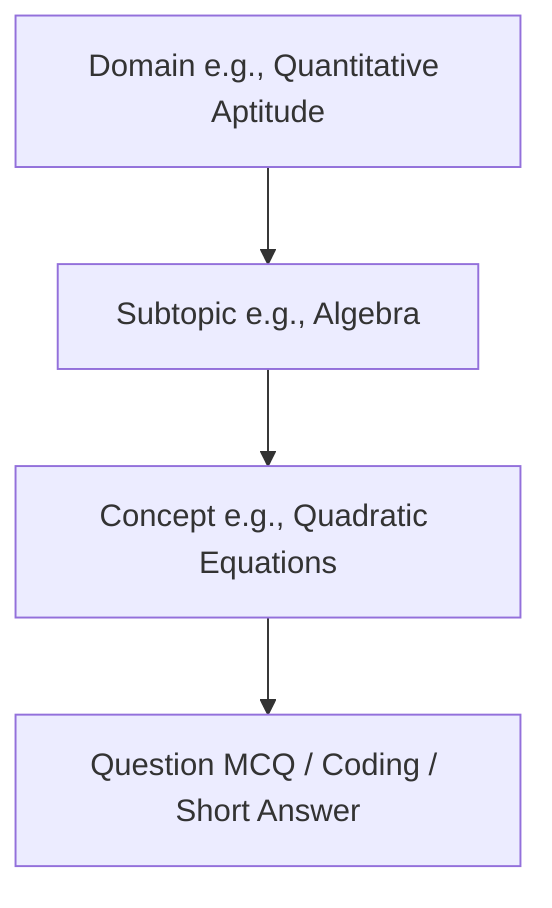

import { Callout } from 'nextra/components'

# Domains Directory

The catalog of all learning categories, subcategories, and specific subjects available on the Kinetic Platform.

---


## Purpose

The main purpose of this module is to ensure system responsiveness, coordinate client events, and maintain relational integrity across data stores.

## Overview & Domain Structure
The Domains Directory is located at [src/app/student/domains/page.tsx](file:///Users/vaishu/Downloads/Base_Project/src/app/student/domains/page.tsx). It displays a Bento-style dashboard containing categories of study, such as Quantitative Aptitude, Logical Reasoning, Verbal Ability, and Coding & CS.



---

## Content Hierarchy
The learning hierarchy is structured into three levels:
1. **Domain**: The main subject area (e.g. `Quantitative Aptitude`).
2. **Sub-topic**: Specific divisions within a domain (e.g. `Time, Speed & Distance` or `Algebra`).
3. **Concept**: Individual learning modules containing explanatory texts, video links, and formula worksheets (e.g. `Quadratic Equations`).

---

## Dynamic Content Loading
When a student selects a domain card:
- A query is dispatched to the `/api/student/domains` endpoint.
- Next.js fetches sub-topics and concept nodes matching the parent `domain_id`.
- The interface renders these nodes in a collapsible roadmap tree, dynamically displaying lesson files on the dashboard.

---

## Progress Aggregation & Completion Logic
- **Concept Progress**: Unlocked when a student finishes reading a concept text or watches the linked walkthrough video. This is stored in `public.progress_tracking` as `progress_percent`.
- **Competency Calculation**: Calculated by dividing the number of correct question attempts by total attempts in that domain:
```math
\text{Competency Score} = \left( \frac{\text{Correct Question Attempts}}{\text{Total Domain Question Attempts}} \right) \times 100
```
- **Domain Completion**: A domain is marked as complete when all containing concepts have `status = 'Completed'` and the average competency score across all quizzes in that domain is at least 75%.

---

## Database Relationships
The taxonomy model relies on these tables:
- **`public.domains`**: Stores top-level category names and IDs.
- **`public.sub_topics`**: Relates to `domains` via a foreign key reference (`domain_id REFERENCES domains(id)`).
- **`public.concepts`**: Relates to `sub_topics` via `sub_topic_id`. Holds pointers to explanatory videos and text content.
- **`public.progress_tracking`**: Holds user progress records, mapping users to concepts with status flags (`Locked`, `In Progress`, `Completed`).

> [!NOTE]
> Progress aggregation uses optimized database triggers that update overall completion statistics in the user's profile card, keeping queries fast and responsive.

---

## Architecture

This component is integrated into the Next.js and Supabase tier, responding dynamically to API endpoints and schema constraints.

---

## Best Practices

<Callout type="info">
  **Best Practice**: Ensure that properties and state interfaces remain synchronized with type definitions across the workspace.
</Callout>

---

## Related Links

Related Reading:
- **[System Overview](../../architecture/system-overview)**: Multi-tier architectural blueprints.
- **[Getting Started](../../getting-started)**: Setup guide for local developers.
