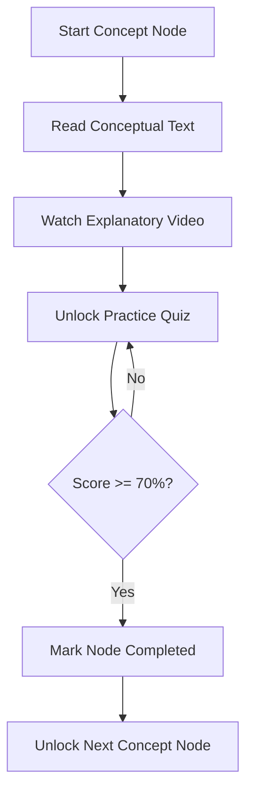

import { Callout } from 'nextra/components'

# Learning Modules

The platform's lesson delivery system, providing text explanations, video lectures, and structured learning paths.

---


## Purpose

The main purpose of this module is to ensure system responsiveness, coordinate client events, and maintain relational integrity across data stores.

## Overview
The Learning Modules provide a structured environment for students to study course materials. It includes step-by-step roadmaps, explanatory videos, interactive transcripts, and formula guides.

---

## The Learning Flow


---

## Video Consumption Tracking
To ensure students watch video explanations:
- **Playback Tracking**: Video frames trigger playback event logging (starts, pauses, and updates).
- **Duration Check**: Nextra tracks playback progress in seconds. A concept is eligible for completion only after the student has viewed at least **80%** of the associated video.
- **Data Log**: View duration statistics are written directly to `public.learning_sessions` using the `/api/student/activity` endpoint.

---

## Progress Checkpoints & Unlocks
- **Checkpoints**: At the end of each concept node, students must complete a 5-question review quiz.
- **Score Requirement**: A score of at least **70%** (minimum 4/5 correct answers) is required to pass.
- **Locked Nodes**: Subsequent sub-topics remain locked until the prerequisite quizzes are completed.

---

## Resume Learning Logic
- **Local Storage Cache**: On every scroll or video pause, the application updates `aptitude_recent_activity` in localStorage with the `concept_id`, page scroll offset, and video progress timestamp.
- **Database Backup**: Periodic updates back up the student's active status to `public.progress_tracking`.
- **Dashboard Quick Link**: On login, the dashboard queries these logs to display the **"Resume Module"** card, letting students jump back into their lessons immediately.

---

## Math Expression Rendering (LaTeX)
All math and science lessons support LaTeX formatting. Formulas are written in standard LaTeX blocks (e.g. `$$2x + 5 = 15$$`) and rendered as math formulas using rehype-katex:

```math
\int_{a}^{b} f(x) \,dx = F(b) - F(a)
```

> [!IMPORTANT]
> If a video is paused or the browser tab loses focus, the duration tracking timer pauses automatically to prevent students from idling to complete lessons.

---

## Architecture

This component is integrated into the Next.js and Supabase tier, responding dynamically to API endpoints and schema constraints.

---

## Best Practices

<Callout type="info">
  **Best Practice**: Ensure that properties and state interfaces remain synchronized with type definitions across the workspace.
</Callout>

---

## Related Links

Related Reading:
- **[System Overview](../../architecture/system-overview)**: Multi-tier architectural blueprints.
- **[Getting Started](../../getting-started)**: Setup guide for local developers.
