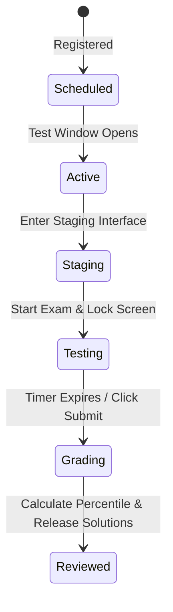

import { Callout } from 'nextra/components'

# Mock Tests

Structured mock tests designed to simulate the format, timing constraints, and rules of actual placement exams.

---


## Purpose

The main purpose of this module is to ensure system responsiveness, coordinate client events, and maintain relational integrity across data stores.

## Overview
The Mock Arena provides a simulated exam environment. It helps students practice time management and exam strategy under strict timing limits, with automated grading and detailed performance reports.

---

## The Assessment Lifecycle


1. **Staging**: The student registers and enters the test lobby.
2. **Testing**: The exam interface loads, locks, and starts the timer.
3. **Grading**: The system evaluates answers and calculates scores immediately after submission.
4. **Reviewed**: The test releases percentile reports, solutions, and explanations.

---

## Technical Features

### 1. Security & Lockdown Simulator
To prevent cheating, the mock interface uses standard browser APIs to detect actions like leaving the tab:
- **Focus Check**: Listening for `visibilitychange` events to detect window switching.
- **Tab Swaps**: If the user leaves the tab more than **3 times**, the exam auto-submits, ending the session.
- **Context Lock**: Blocks keyboard actions like copy/paste and right-click menus.

### 2. Time Tracking & Auto-Submit
- **Countdown Timer**: Uses a worker thread to run countdown timers, preventing lag.
- **Auto-Submit Trigger**: If the timer reaches zero, the interface disables inputs and auto-submits current answers.

### 3. Scoring System
- **Formula**:
```math
\text{Final Score} = (\text{Correct Answers} \times \text{Positive Mark}) - (\text{Incorrect Answers} \times \text{Negative Penalty})
```
- **Standard Settings**: Correct answers earn **+1.0**, while incorrect selections deduct **-0.25** to match competitive exam scoring rules.

### 4. Leaderboard Integration
- Upon submission, the score is saved, updating the test's `user_mock_sessions` table.
- A background worker aggregates scores, calculates candidate percentiles, and updates ranks on the test's leaderboard.

> [!WARNING]
> Refreshing the browser or losing your internet connection during an active mock exam does not pause the timer. The timer runs server-side to prevent timing exploits.

---

## Architecture

This component is integrated into the Next.js and Supabase tier, responding dynamically to API endpoints and schema constraints.

---

## Best Practices

<Callout type="info">
  **Best Practice**: Ensure that properties and state interfaces remain synchronized with type definitions across the workspace.
</Callout>

---

## Related Links

Related Reading:
- **[System Overview](../../architecture/system-overview)**: Multi-tier architectural blueprints.
- **[Getting Started](../../getting-started)**: Setup guide for local developers.
