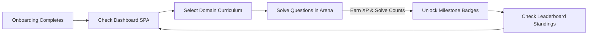

import { Cards, Callout } from 'nextra/components'

  

  

    

      Student Portal
    

    <h1 className="text-2xl font-black tracking-tight text-slate-900 dark:text-white my-0 leading-tight">
      Student Dashboard
    </h1>
    

      Guides detailing student dashboards SPA, curriculum topics directory, interactive math workspaces, custom practices, placements hub, and gamification streaks.
    

  

---

## Overview

Welcome to the Student Dashboard specifications section. This guide provides developers, designers, and system managers with detailed layouts of the student single page application (SPA), math practice areas, global leaderboards, and gamification streak calculators.

## Purpose

The main purpose of the Student Dashboard is to deliver an adaptive and highly engaging learning environment. By combining real-time XP collection, structured curriculum maps, and automated streak calculators, we motivate students to engage with academic content daily.

## Architecture / Flow

Our client learning application comprises several interactive modules:

  

    Daily Track
    Streaks System
  

  

    LaTeX KaTeX
    Learning Paths
  

  

    Badges & Scores
    Gamification
  

  

    Timed MCQs
    Practice Workspace
  

## Data Flow

The flow diagram below tracks a student's active practice loop:

## Key Components

Select a guide section to explore:

<Cards>
  <Cards.Card icon="📈" title="Dashboard SPA Layout" href="./dashboard">
    Streaks calculations, XP level indicators, and curriculum progress widgets.
  </Cards.Card>
  <Cards.Card icon="📁" title="Domains Directory" href="./domains">
    Quantitative, Logical, Verbal, and Coding curriculums lists.
  </Cards.Card>
  <Cards.Card icon="🧠" title="Learning Modules" href="./learning">
    Interactive formula guides, discussion boards, and video walkthrough players.
  </Cards.Card>
  <Cards.Card icon="⚔️" title="Practice Arena" href="./practice-arena">
    Timed practice test workspaces, scoring guidelines, and feedback prompts.
  </Cards.Card>
  <Cards.Card icon="📝" title="Mock Tests Simulator" href="./mock-tests">
    Full exam interfaces, placement simulations, and score statistics sheets.
  </Cards.Card>
  <Cards.Card icon="💼" title="Career Hub Placements" href="./career-hub">
    Company aptitude preparation cards and placement roadmaps.
  </Cards.Card>
  <Cards.Card icon="🏆" title="Leaderboards Index" href="./leaderboard">
    Global and institutional scoreboards comparison lists.
  </Cards.Card>
  <Cards.Card icon="🏅" title="Profile & Badges" href="./profile">
    Gamification milestone requirements and daily tracking logs.
  </Cards.Card>
</Cards>

## Database Impact

The daily streak calculation is completed inside a database trigger when a user logs a solve event. The client dashboard executes queries at `/api/student/activity` and maps visual representations using local component clocks.

## Best Practices

<Callout type="warning">
  **Warning**: Make sure to check that the timezone offsets on the client match UTC timestamps when computing streaks parameters to avoid calendar alignment bugs.
</Callout>

<Callout type="info">
  **Gamification Rule**: Solving any question correctly logs user XP. The daily streak index is computed by checking differences in daily submission logs timestamps.
</Callout>

## Related Documents

Related Reading:
- **[UI Components Specs](../components)**: Properties for client widgets (e.g. BentoCards and toggles).
- **[Database tables mapping](../database)**: Schema layout matching progress databases tables.
- **[Product Onboarding Guides](../product)**: Questionnaire steps checking guidelines.
