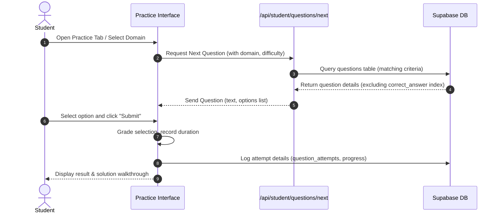

import { Callout } from 'nextra/components'

# Practice Arena

The interactive practice workspace, featuring adaptive question selection, company-specific test sets, and detailed solutions.

---

## Purpose

The main purpose of this module is to ensure system responsiveness, coordinate client events, and maintain relational integrity across data stores.

## Overview
The Practice Arena is designed to reinforce learning concepts. It provides a clean, distraction-free environment for answering questions, with whiteboard scratchpads, formula sheets, and detailed video solutions.

---

## Question Delivery Flow

---

## Question Filtering & Company-Based Practice
Students can customize their practice sessions using the following filters:
- **Domain Filter**: Filter questions by Quantitative, Logical, Verbal, or Coding subjects.
- **Difficulty Filter**: Focus practice on Easy, Medium, or Hard questions.
- **Company Tagging**: Select question sets tagged for specific recruiters (e.g. TCS NQT, Microsoft, Goldman Sachs). This queries the `question_companies` cross-reference table.

---

## Adaptive Recommendation Engine
To optimize study efficiency, the platform adapts question difficulty based on student performance:
- **Competency Window**: The engine monitors the student's last 5 question attempts.
- **Scale Rules**:
  - If accuracy is `>= 80%` (at least 4/5 correct), the engine automatically increases the difficulty of the next question (e.g., from Medium to Hard).
  - If accuracy falls `<= 40%` (2/5 or fewer correct), the engine decreases the difficulty (e.g., from Medium to Easy) and recommends reviewing the concept video.
  - Otherwise, the engine continues delivering questions at the current difficulty level.

---

## Key Workspace Features
- **On-Screen whiteboard**: A canvas tool allowing students to draft equations and draw diagrams next to the question.
- **Mentor Tips**: Brief strategies for answering complex questions quickly.
- **LaTeX Math Formulas**: Visual math notation rendering powered by KaTeX.

> [!WARNING]
> Correct answer attributes are omitted from client-side payloads when fetching questions to prevent answers from leaking via the browser inspector.

---

## Architecture

This component is integrated into the Next.js and Supabase tier, responding dynamically to API endpoints and schema constraints.

---

## Best Practices

<Callout type="info">
  **Best Practice**: Ensure that properties and state interfaces remain synchronized with type definitions across the workspace.
</Callout>

---

## Related Links

Related Reading:
- **[System Overview](../../architecture/system-overview)**: Multi-tier architectural blueprints.
- **[Getting Started](../../getting-started)**: Setup guide for local developers.
