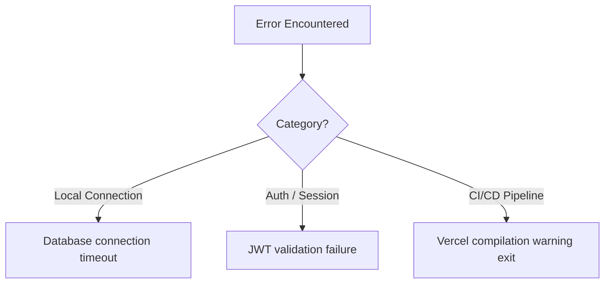
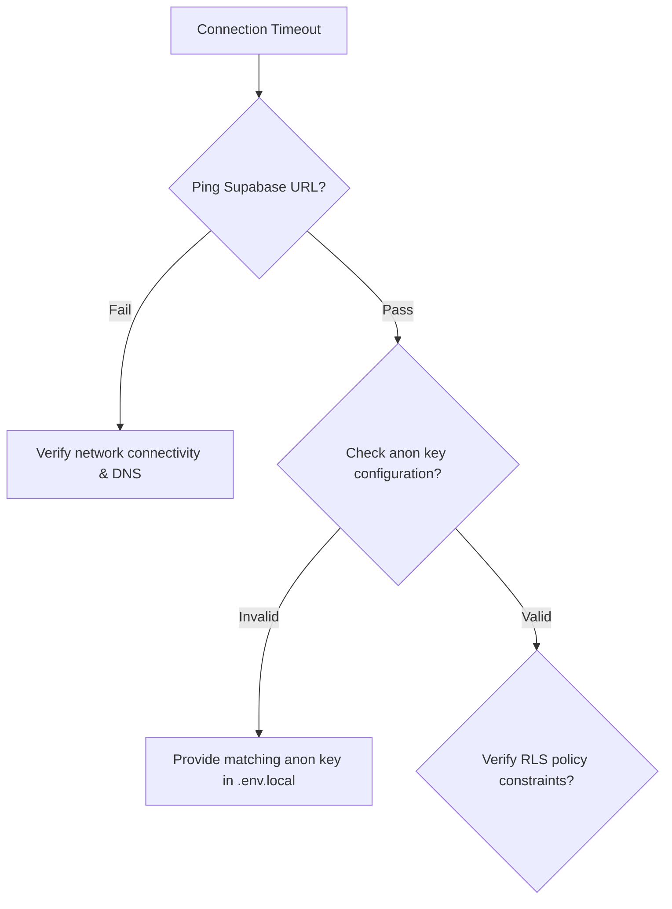

import { Callout } from 'nextra/components'

# Troubleshooting Guide

Solutions and diagnostic guides for common database connections, session expirations, pre-rendering errors, and deployment warnings.

---

## Overview

This guide details resolutions for developers and coordinators experiencing setup problems, validation exceptions, static compiling warnings, or build errors in Base Institute.

## Purpose

The troubleshooting guide acts as a rapid runbook to diagnose, isolate, and repair standard system anomalies. It ensures team members can unblock their development flow independently.

## Architecture / Flow

Anomaly triggers generally arise from configuration, environment mismatches, or network timeouts:

## Data Flow

The flow below displays the diagnostic checks for a database connection timeout:

## Key Components

Below are standard issues, categorized with their corresponding root causes, diagnostic paths, and resolution steps.

### 1. Next.js Build Errors

* **Root Cause**: Next.js typescript check failure or missing environment variables during compiling stage. Often caused by undeclared types in page route files or components.
* **Diagnosis Steps**:
  1. Run `npm run build` locally to trigger the production build process.
  2. Inspect the terminal stdout for TypeScript compiler errors (e.g., `Type '...' is not assignable to type '...'`).
  3. Verify that all required environment variables are listed in `.env.local`.
* **Resolution Steps**:
  1. Fix the syntax or type declarations flagged in the error trace.
  2. If the error is related to external type libraries, ensure the packages are defined in `package.json` under dependencies.
  3. Run `npx tsc --noEmit` to verify all TS files resolve successfully before running the build.

### 2. MDX Parsing Errors

* **Root Cause**: Using unescaped special characters like `<` or `{` inside MDX content, or incorrect nesting of components. Since MDX compiles pages to React elements, special characters are treated as HTML tags or JS blocks.
* **Diagnosis Steps**:
  1. Look for compiling errors like `Expected corresponding JSX closing tag` or `Unexpected character`.
  2. Open the offending file in your IDE to check if any math expressions contain `<` without surrounding backticks or spaces.
* **Resolution Steps**:
  1. Wrap inline mathematical comparisons in code blocks (e.g., `` `a < b` ``) or use HTML entities (e.g., `&lt;` for `<` and `&gt;` for `>`).
  2. Ensure any custom components like `<Callout>` have appropriate closing tags.

### 3. Nextra Component Errors

* **Root Cause**: Importing components from the wrong Nextra version or missing the required imports in page files. Under Nextra v4, component importing routes differ from Nextra v3.
* **Diagnosis Steps**:
  1. Look for runtime errors like `Cannot read properties of undefined (reading 'Tab')` or `Callout is not defined`.
  2. Inspect the import header of the `.mdx` file.
* **Resolution Steps**:
  1. Update imports to standard: `import { Callout, Tabs, Cards } from 'nextra/components'`.
  2. Ensure your `next.config.mjs` has the correct Nextra plugin setup and version mappings configured.

### 4. Database Connection Mismatches

* **Root Cause**: Database client timeout, credentials expired, or Supabase project paused.
* **Diagnosis Steps**:
  1. Run `ping` to ensure network connectivity to Supabase URL.
  2. Verify if client fetches fail with code `500` or database logs show authentication errors.
* **Resolution Steps**:
  1. Check `.env.local` to make sure `NEXT_PUBLIC_SUPABASE_URL` and `NEXT_PUBLIC_SUPABASE_ANON_KEY` are correct.
  2. Access the Supabase dashboard to verify if the project is active or has been paused.
  3. Verify security configurations if local IP filters block developer environments.

### 5. Authentication Failures

* **Root Cause**: Expired session tokens, mismatched OAuth callback redirect URLs, or database trigger errors during user creation.
* **Diagnosis Steps**:
  1. Inspect browser storage to check for presence of token keys.
  2. Open browser inspector network logs and audit details of `/api/auth/verify` responses.
* **Resolution Steps**:
  1. Clear cookie stores and attempt credentials sign-ins.
  2. Confirm Google Cloud Platform configurations have redirect URI set to matching environment callbacks (e.g., `http://localhost:3000/api/auth/callback`).
  3. Check Supabase database logs for execution failures in profiles sync triggers.

### 6. Deployment Pipeline Warnings

* **Root Cause**: Code formatting mismatches (e.g., ESLint failures) or warnings treated as errors in Vercel CI settings.
* **Diagnosis Steps**:
  1. Check Vercel build log console to track exit code reason.
  2. Run `npm run lint` locally to identify code formatting standard issues.
* **Resolution Steps**:
  1. Fix ESLint configurations or format code using `npm run lint -- --fix`.
  2. Set Vercel configuration variables to prevent build termination due to warnings if appropriate, though resolving warnings directly is recommended.

---

## Database Impact

Diagnostic logs are output to the standard Node stdout console in local dev, and can be audited via the Vercel Deploy Log consoles in staging or production. Mismatches in environment variables can lead to failed database reads or writes.

---

## Best Practices

<Callout type="warning">
  **Release Blockers**: Never ignore compilation or linting warnings. If a PR has type check issues, the deployment pipeline will abort.
</Callout>

<Callout type="info">
  **Staging Test**: Always test database migrations on a local branch database instance before running push scripts on staging database environments.
</Callout>

---

## Related Documents

Related Reading:
- **[Getting Started guide](../getting-started)**: Environment configurations checklist.
- **[Deployment Specifications](../deployment)**: Pipeline rules checklist.
- **[API References Guides](../api)**: Status code mappings lists.
